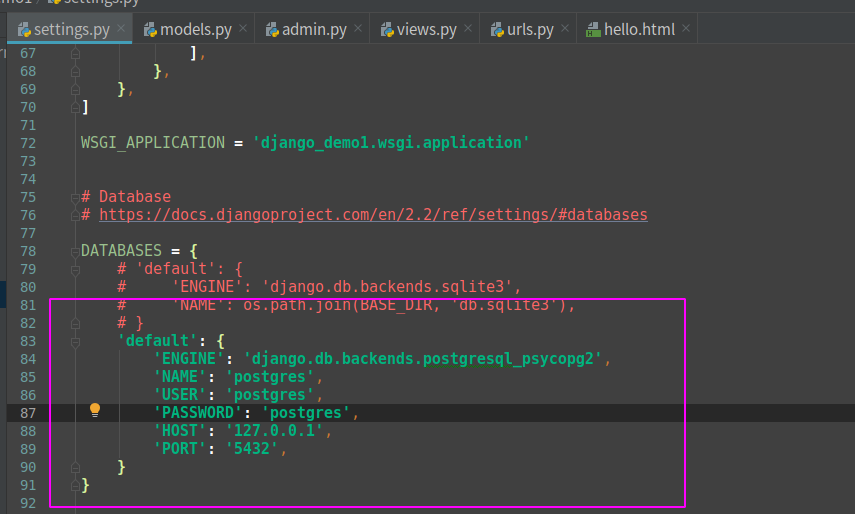
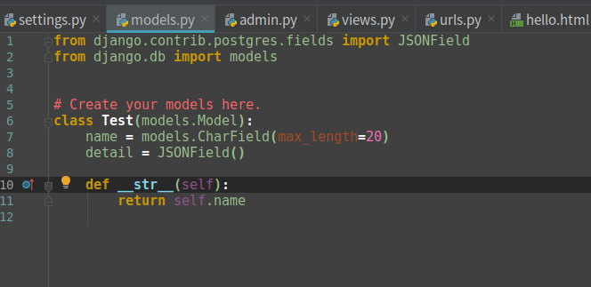
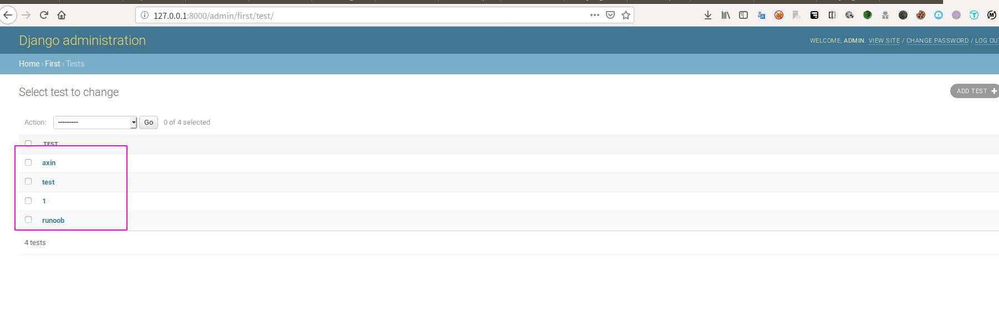
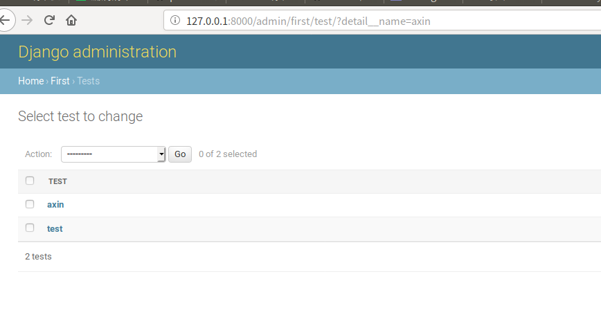
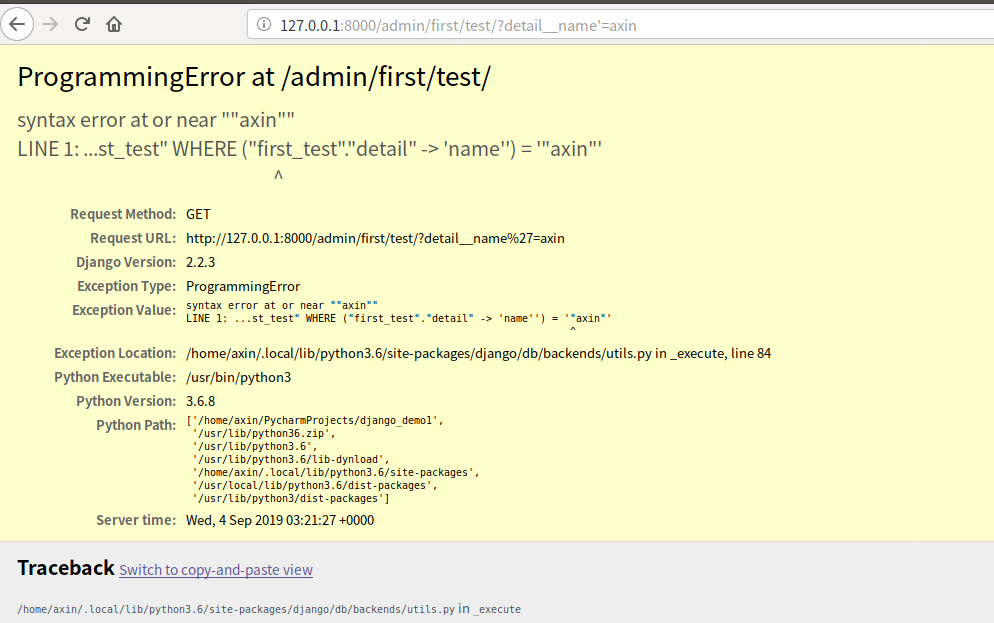

### 参考
本文只做简单的复现，漏洞原理请参见p牛博客
https://www.leavesongs.com/PENETRATION/django-jsonfield-cve-2019-14234.html

### 复现环境

django2.2.3

### 复现

在settings.py中配置好数据库连接，连接到postgresql

当然连接数据库之前需要安装postgresql，这些，大家自行解决吧，然后models创建如下

创建了models还要记得，执行相应命令，postgresql才会创建相应数据库与表，具体参考：http://www.runoob.com/django/django-model.html

然后在admin.py中添加

`admin.site.register(models.Test)`

把我刚刚创建的models给注册到django自带的管理后台中，然后我们就可以到管理后台去操作数据库了

现在可以直接在url处输入我们的查询条件，下面是一个正常的查询

我们再构造一个恶意的sql查询，例如添加一个单引号

sql语句报错了，说明此处确存在sql注入问题。

