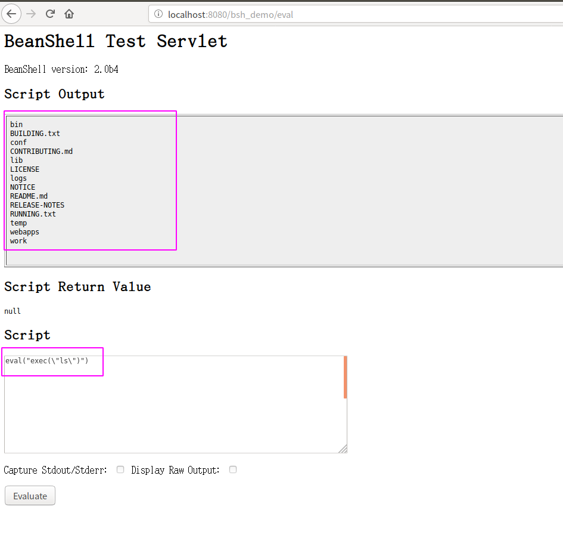

### 原理简述

这个漏洞起因是因为使用了beanshell这个组件，并且没有做任何的访问控制。导致可以直接访问beanshell,执行任意命令。

###  漏洞复现

直接访问`/weaver/bsh.servlet.BshServlet`

可以使用exec()执行命令，例如：
`exec("whoami")`

记住，是双引号，而且泛微oa应该拦截了一些关键词（exec好像就被拦截了，但是有方法可以绕过）

### 漏洞分析

http://www.liuhaihua.cn/archives/614038.html

#### 其他

其实我再测试这个漏洞之前，先是本地搭建了一个beanshell用于测试的，beanshell官方文档（https://beanshell.github.io/manual/bshmanual.html#Useful_BeanShell_Commands）
有测试war包下载，搭建好过后其实和真实环境的界面一样，不过没有做关键字拦截，你可以执行任意命令，如下：

### python poc

ecology_oa_cmd_exec.py（暂不放出）
