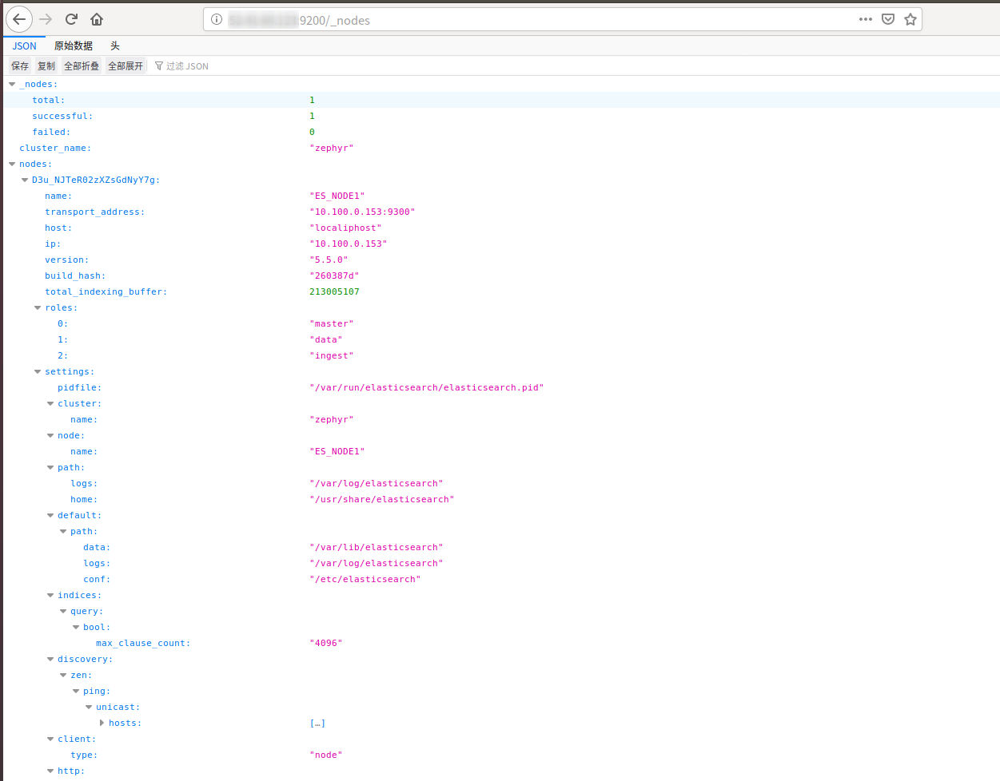

### 漏洞概述

Elasticsearch 是一款 java 编写的企业级搜索服务。越来越多的公司使用 ELK 作为日志分析，启动此服务默认会开放9200端口，可被非法操作数据

### 利用方法

漏洞检测：默认端口9200

相当于一个API，任何人访问这个地址，就可以调用api，进行数据的增删改操作。

http://x.x.x.x:9200/_nodes

http://x.x.x.x:9200/_river

### 防御

1、防火墙上设置禁止外网访问 9200 端口。

2、使用 Nginx 搭建反向代理，通过配置 Nginx 实现对 Elasticsearch 的认证

3、限制IP访问，绑定固定IP

4、在config/elasticsearch.yml中为 9200 端口设置认证：