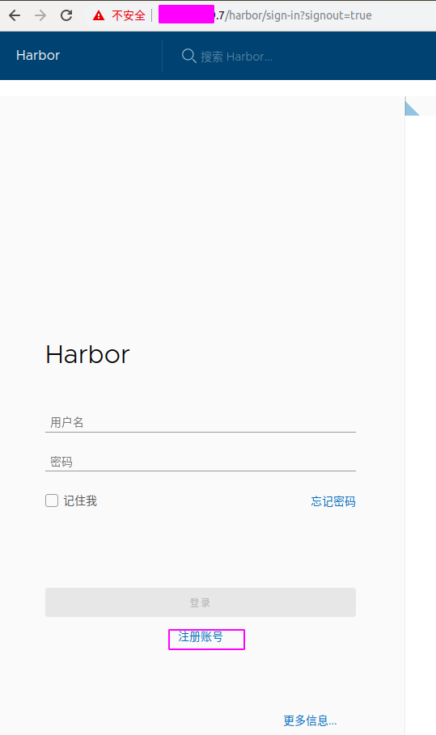
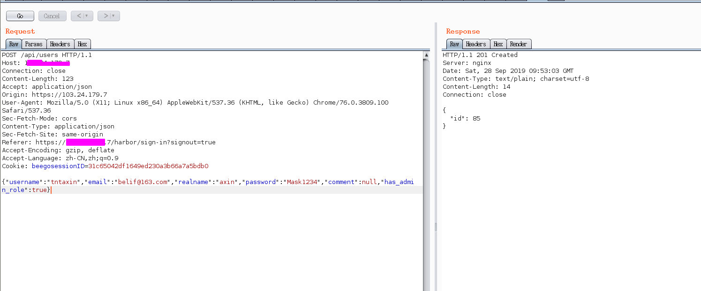
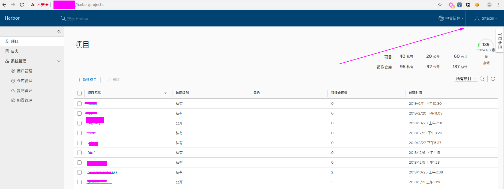
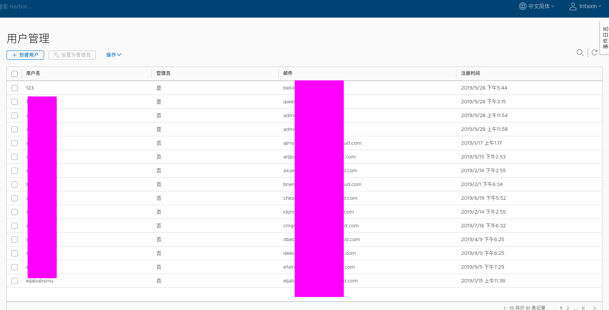

### 漏洞简介

因注册模块对参数校验不严格，可导致任意管理员注册。
- 危及版本：	Harbor 1.7.6之前版本 Harbor 1.8.3之前版本

Harbor 1.7.6之前版本和Harbor 1.8.3之前版本中的core/api/user.go文件存在安全漏洞。若开放注册功能，攻击者可利用该漏洞创建admin账户。注册功能默认开放。攻击者可以以管理员身份下载私有项目并审计；可以删除或污染所有镜像。

### 漏洞利用

在登录页面点击注册账号，然后随意注册一个账号，抓包，在发送的jons数据最后添加：

`"has_admin_role":true`

我们用这个账号尝试登录

我刚刚添加的123用户也是管理员权限，tntaxin也就是登录的这个账户也是管理员权限

