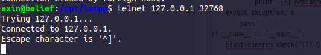

### 环境搭建

可以去docker hub上找一个memcached的镜像

### 复现方法

telnet ip port




### python3 poc

``` python
# _*_  coding:utf-8 _*_
import socket
import time


def Memcache_check(ip, port=11211, timeout=5):
    try:
        socket.setdefaulttimeout(timeout)
        s = socket.socket(socket.AF_INET, socket.SOCK_STREAM)
        s.connect((ip, int(port)))
        s.send(b"stats\r\n")
        result = s.recv(1024)
        print(result)
        if b"STAT version" in result:
            print('[+] Memcache Unauthorized: ' +ip+':'+str(port))
    except Exception as e:
        print(e)


if __name__ == '__main__':
    Memcache_check('127.0.0.1', 32768)
```