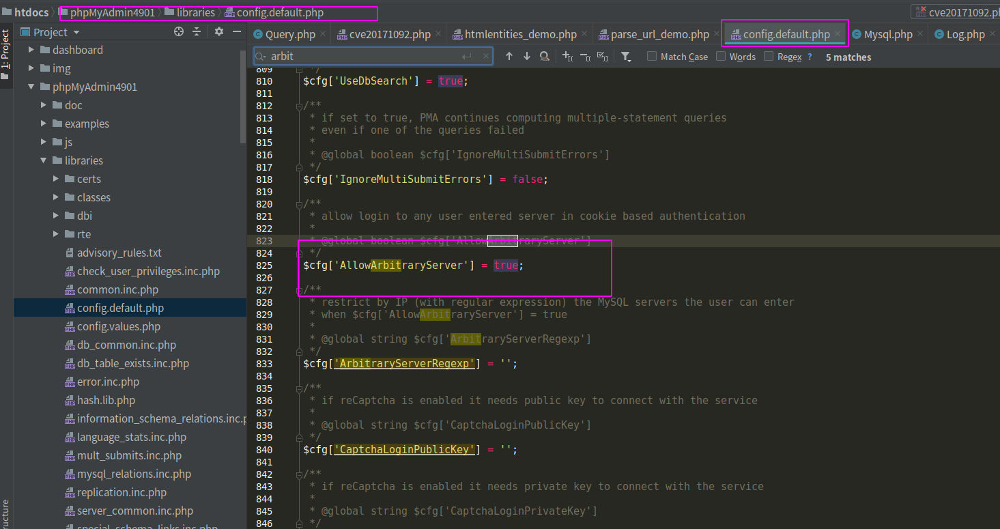
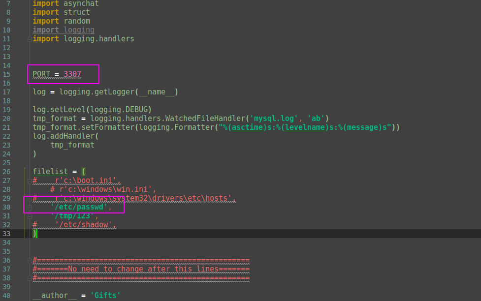
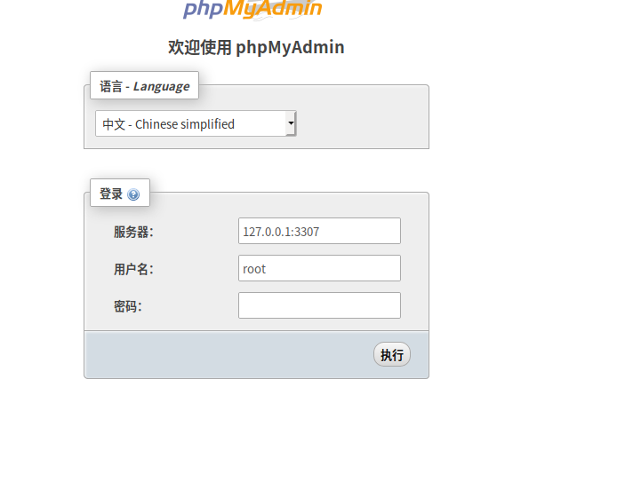
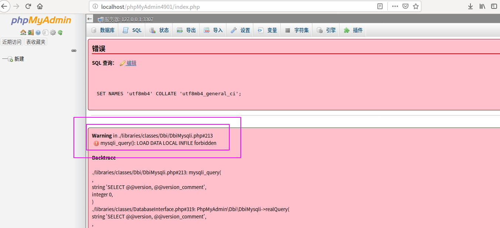

MYSQL LOAD DATA INFILE 任意文件读取漏洞
--

### 参考

vulspy漏洞环境：https://www.vulnspy.com/cn-phpmyadmin-load-data-local-file-read-local-file/

http://aq.mk/index.php/archives/23/

### 失败的一次复现

下载phpmadmin4.9.0.1版本，修改配置文件

这里修改的目的是为了让我们的phpmyadmin可以连接到任意的mysql服务器，如果不配置，phpmyadmin默认只能连接本地的。

然后我们需要自己构造一个恶意的mysql服务器，有现成的脚本：

https://github.com/Gifts/Rogue-MySql-Server

这个脚本需要修改一下，主要是修改监听的端口与读取的文件：

修改完过后，运行该py文件，可以发现我们的服务器已经监听3307这个端口了

这就说明我们的恶意mysql服务已经启动，接下来只需要使用phpmyadmin登录这个恶意mysql服务器就可以读取到phpmyadmin服务器上的文件了

理论上，这个时候我们mysql恶意脚本的同目录下会生成一个mysql.log文件，这个文件里就会有读取到的文件内容，但是我这里失败了，应该是mysql版本问题？或是php版本？显示forbidden了，但是使用vulspy环境可以成功复现

利用流程就是上面那样了，这个漏洞主要就是利用load data infile 语句，加载客户端的文件，所以和服务端配置无关，主要是和客户端mysql相关。