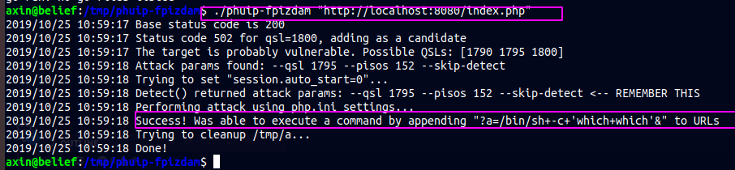
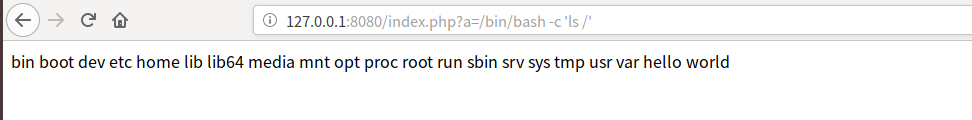
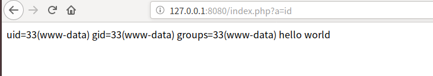

PHP-FPM Remote Command Execution (CVE-2019-11043)
--

在长亭科技举办的 Real World CTF 中，国外安全研究员 Andrew Danau 在解决一道 CTF 题目时发现，向目标服务器 URL 发送 %0a 符号时，服务返回异常，疑似存在漏洞。

在使用一些有错误的Nginx配置的情况下，通过恶意构造的数据包，即可让PHP-FPM执行任意代码。

#### 复现

我们采用vulhub环境进行复现
vulhub地址：https://github.com/vulhub/vulhub/blob/master/php/CVE-2019-11043/README.zh-cn.md

下载vulhub项目，进入php -> cve-2019-11043目录，然后执行
`docker-compose up -d`
会下载并启动docker漏洞环境，web服务会映射到宿主机的8080端口，注意你的端口是否被占用。启动成功后，访问`http://your-ip:8080/index.php`会看到默认页面hello world.

然后我们使用漏洞利用工具：https://github.com/neex/phuip-fpizdam
该工具采用go语言编写，在使用之前需要先编译，git clone上面链接中的项目，然后切换到目录phuip-fpizdam执行：
`go build`
正常情况下（前提是你的系统安装了go语言）就会在同目录下生成一个可执行文件

然后我们就可以执行一下命令来复现漏洞了(reproduce)：

`./phuip-fpizdam http://your-ip:8080/index.php`

然后我们去浏览器试一下，看看能否实现命令执行

执行命令一次可能执行不成功，多执行几次（注意，因为php-fpm会启动多个子进程，在访问/index.php?a=id时需要多访问几次，以访问到被污染的进程。）

