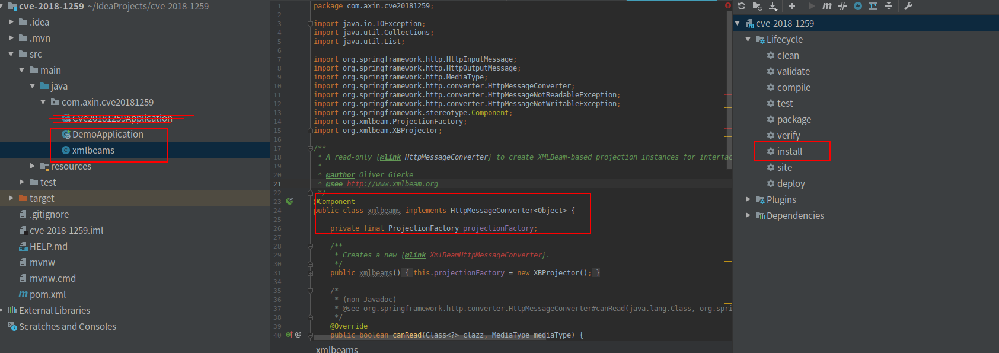
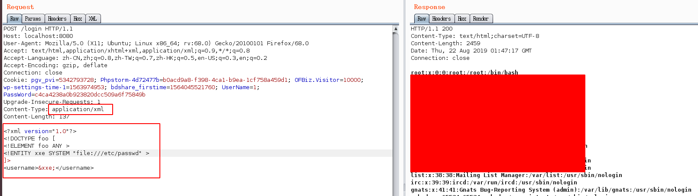

XMLBeam-XXE复现（cve-2018-1259）
--

### 前言

这个漏洞是XMLBeam的问题，但是还是被spring背了锅

### 漏洞简介

Spring Data Commons 版本在 1.13—1.13.11 和 2.0—2.0.6 ，Spring Data REST 版本在 2.6-2.6.11 和 3.0-3.0.6，因为使用了小于等于 1.4.14 版本的 XMLBeam 导致存在XML实体注入漏洞

###  利用条件

在渗透中需要知道哪个参数使用来了xmlbeam解析

### 利用方法

使用 IDEA 创建一个 名为 demo 的 Spring Boot 应用，主要是添加一个 "/login" RequestMapping URL映射路径，模拟使用XML数据认证进行登录。

主要代码文件 DemoAppliction.java 如下： 

```java
package com.example.demo;
import org.springframework.boot.SpringApplication;
import org.springframework.web.bind.annotation.RequestMethod;
import org.xmlbeam.annotation.XBRead;
import org.springframework.web.bind.annotation.RequestBody;
import org.springframework.web.bind.annotation.RequestMapping;
import org.springframework.web.bind.annotation.RestController;
import org.springframework.boot.autoconfigure.SpringBootApplication;

@RestController
@SpringBootApplication
public class DemoApplication {
   @RequestMapping(value = "/login", method = RequestMethod.POST)
   public String handleCustomer(@RequestBody Customer customer) {
      return String.format("%s:%s login success!", customer.getFirstname(), customer.getLastname());
   }
   public static void main(String[] args) {
      SpringApplication.run(DemoApplication.class, args);
   }
   public interface Customer {
      @XBRead("//username")
      String getFirstname();
      @XBRead("//password")
      String getLastname();
   }
}
```

同目录下的 xmlbeams.java 文件使用 Example 示例文件(https://github.com/olivergierke/spring-examples/blob/master/scratchpad/src/main/java/example/xmlbeam/XmlBeamHttpMessageConverter.java)的代码。

最后再在 pom.xml 中增加依赖，并用 IDEA 解决(alt + L键)此依赖问题。 或者直接maven视图执行install安装依赖。



运行起来，我们访问/login,并发送xml数据，如下



###  python poc
这个漏洞没办法写出通用的poc


