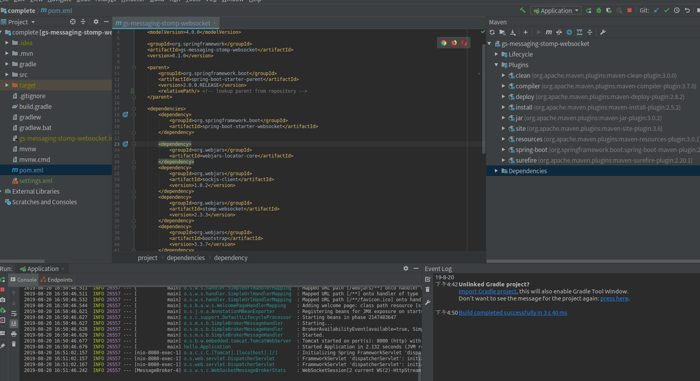
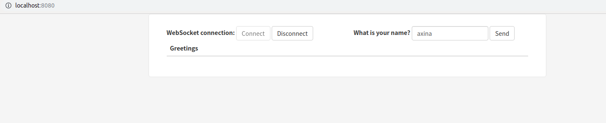
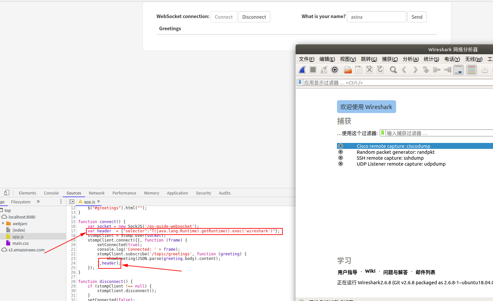

CVE-2018-1270复现
--

### 漏洞简介

STOMP（Simple Text Orientated Messaging Protocol）全称为简单文本定向消息协议，它是一种在客户端与中转服务端（消息代理Broker）之间进行异步消息传输的简单通用协议，它定义了服务端与客户端之间的格式化文本传输方式。已经在被许多消息中间件与客户端工具所支持。STOMP协议规范：https://stomp.github.io/stomp-specification-1.0.html

Spring框架中的 spring-messaging 模块提供了一种基于WebSocket的STOMP协议实现，STOMP消息代理在处理客户端消息时存在SpEL表达式注入漏洞，攻击者可以通过构造恶意的消息来实现远程代码执行。

影响范围：SpringFramework 5.0 ~ 5.0.4，4.3 ~ 4.3.14，以及停止维护的更老版本均受影响

最新安全公告：https://pivotal.io/security/cve-2018-1275

修复方案：

1.请升级Spring框架到最新版本(5.0.5、4.3.15及以上版本);

2.如果你在用 SpringBoot，请升级到最新版本(2.0.1及以上版本);

同时Spring还修复其他两个漏洞，有兴趣的朋友可以自行分析下： https://pivotal.io/security/cve-2018-1271 https://pivotal.io/security/cve-2018-1272

### 环境搭建

搭建指南：https://spring.io/guides/gs/intellij-idea/

示例项目：https://github.com/spring-guides/gs-messaging-stomp-websocket

下载示例环境代码：

```
git clone https://github.com/spring-guides/gs-messaging-stomp-websocket
git checkout 6958af0b02bf05282673826b73cd7a85e84c12d3
```

打开IntelliJ IDEA，在欢迎界面点击Import Project，选择刚下载的gs-messaging-stomp-websocket示例程序中complete项目下的Maven pom.xml文件，进行导入，一顿Next操作之后，IDEA会创建一个可以直接运行的项目。

点击运行，启动Spring Boot服务，访问http://localhost:8080/。 






篡改前端app.js中Websocket connect函数中，插入恶意selector代码，PoC如下：

```
var header  = {"selector":"T(java.lang.Runtime).getRuntime().exec('wireshark')"};
```



我上面的poc就是启动我的wireshark,效果如上图

### 修复方案

修复测试，我们将pom.xml中的org.springframework.boot设置到2.0.1版本，org.springframework.boot中会引用5.0.5版本的Spring框架。再测试则会发现漏洞已经无法利用了。pom.xml：

```
 <parent>
        <groupId>org.springframework.boot</groupId>
        <artifactId>spring-boot-starter-parent</artifactId>
        <version>2.0.1.RELEASE</version>
    </parent>
```


### 注：
文档来源：https://kingx.me/spring-messaging-rce-cve-2018-1270.html
加了点自己实践的截图

https://chybeta.github.io/2018/04/07/spring-messaging-Remote-Code-Execution-%E5%88%86%E6%9E%90-%E3%80%90CVE-2018-1270%E3%80%91/


漏洞分析：http://blog.nsfocus.net/spring-messaging-analysis/