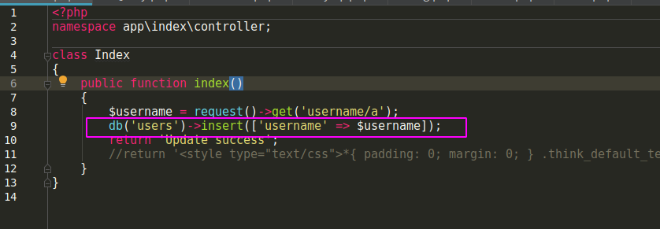
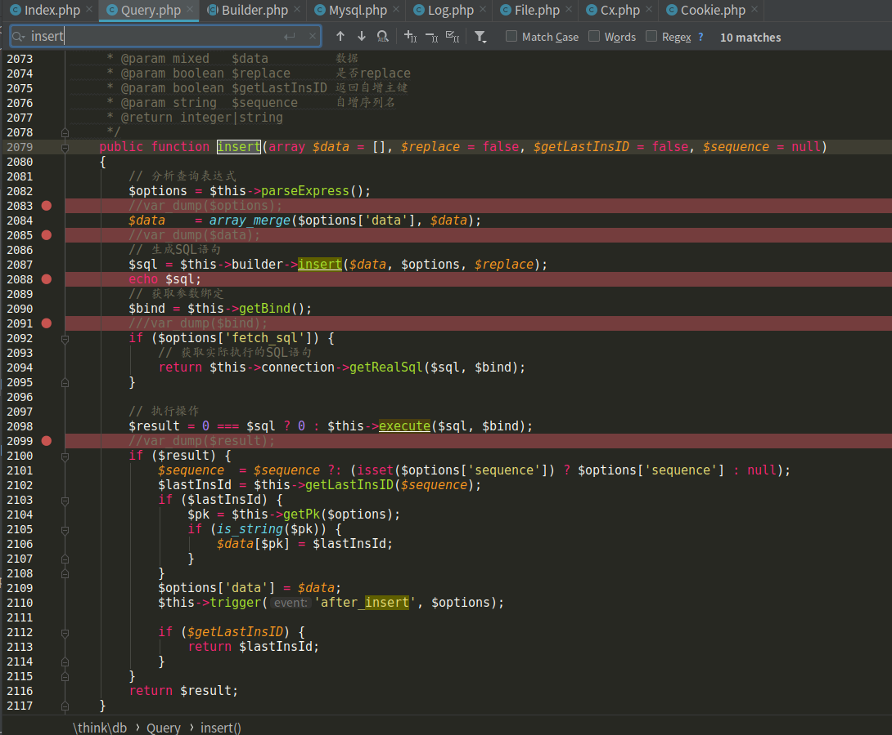
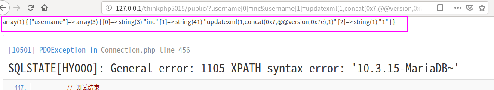
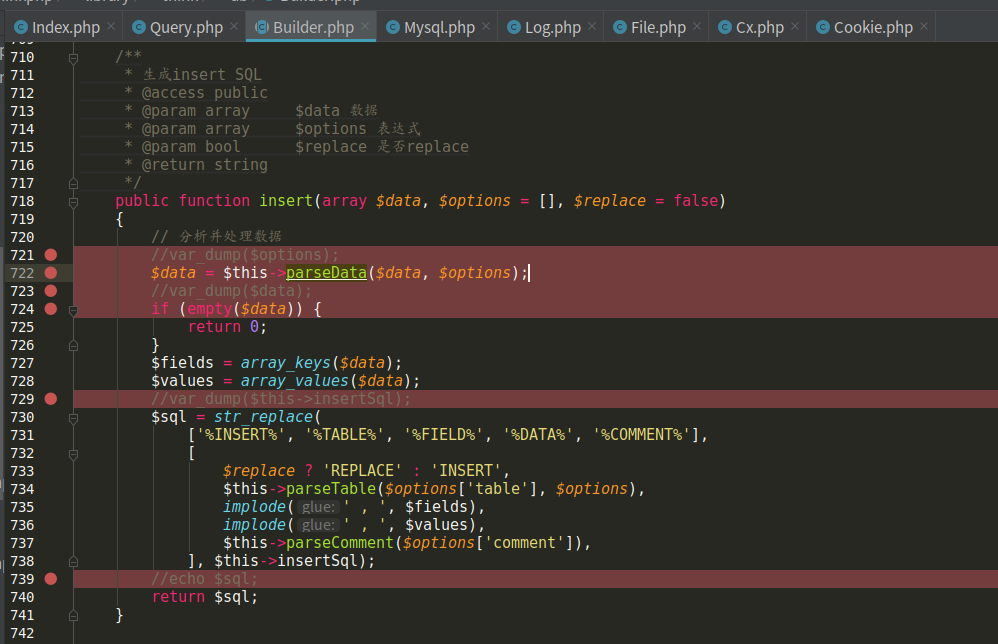
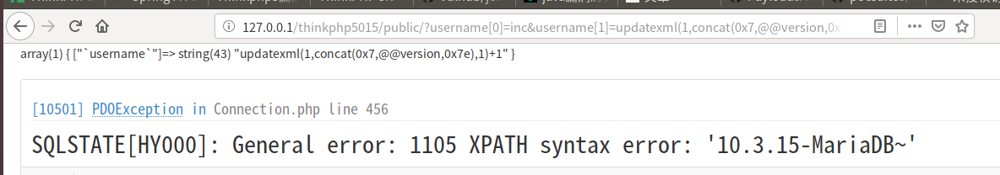
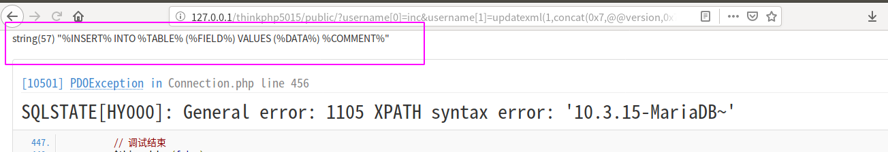
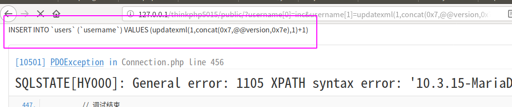

### 漏洞概述

本次漏洞存在于 Builder 类的 parseData 方法中。由于程序没有对数据进行很好的过滤，将数据拼接进 SQL 语句，导致 SQL注入漏洞 的产生。漏洞影响版本： 5.0.13<=ThinkPHP<=5.0.15 、 5.1.0<=ThinkPHP<=5.1.5 。

### 复现环境

lamp集成环境lammp
thinkphp 5.0.15

### 复现方法

将 application/index/controller/Index.php 文件代码设置如下：

```php
<?php
namespace app\index\controller;

class Index
{
    public function index()
    {
        $username = request()->get('username/a');
        db('users')->insert(['username' => $username]);
        return 'Update success';
    }
}
```

在 application/database.php 文件中配置数据库相关信息，并开启 application/config.php 中的 app_debug 和 app_trace (不开启app_debug是看不到报错信息的)。创建数据库信息如下：

```
create database tpdemo;
use tpdemo;
create table users(
	id int primary key auto_increment,
	username varchar(50) not null
);
```


http://127.0.0.1/thinkphp5015/public/?username[0]=inc&username[1]=updatexml(1,concat(0x7,@@version,0x7e),1)&username[2]=1


###  漏洞分析

此处是一个insert语句导致的注入，虽然tp中用各种函数来封装了sql语句的操作，但是这些函数执行的最终结果还是简单的拼接用户输入到sql语句中，从而发生了sql注入，为了便于理解，我们就直接跟着payload来分析这个漏洞。



我们在index这个控制器中执行了一个insert操作。

其中`db('users')`这个函数执行的结果会返回一个Query对象（详情可以跟一下db助手函数），然后执行了Query的insert方法，所以，我们接下来就是跟进insert方法去看一看



图中的断点都是我自己添加的一些代码，都是输出某个数据的值，手动调试只有这种笨方法233333

首先执行了`parseExpress`,但是这个函数在本次利用链中没有什么关系，我们只需要知道最终传入`$this->builder->insert()`函数的`$data`的值，我通过`var_dump($data)`的方式，看了一下它的值，如下



到目前位置，我们的payload:`updatexml(1,concat(......)))`还没有被过滤掉，那我们继续根据`$this->builder->insert()`的insert函数，这个`$this->builder`表示的是Builder对象。



可以看到首先就是执行了一个parseData函数，但是我们不着急跟进这个函数，我们直接看他返回的值`$data`



先不管parseData到底做了什么，我们只关心他并没有对我们的payload进行任何安全过滤，那么我们就可以继续往下分析了。剩下的代码实际上只做了一件事，那就是根据insert模板语句，通过str_replace函数这种简单替换字符串的方式得到最后真实的sql语句。而模板语句就是`$this->insertSql`，也就是



经过替换后，得到最后的sql语句如下



最后这个sql语句会在Query.php中的insert函数中传入到execute函数，得到执行


